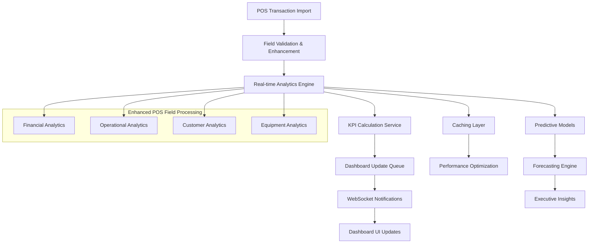

# Dashboard Integration Strategy
## Comprehensive Strategy for Integrating 100+ POS Fields into Executive and Manager Dashboards

**Generated:** September 12, 2025  
**Author:** AI Analytics System  
**Scope:** Integration of enhanced POS analytics into existing dashboard templates

---

## 🎯 Executive Summary

This strategy document details how to integrate the newly available 100+ POS transaction fields into the existing dashboard infrastructure at `/home/tim/RFID3/app/templates/`. The approach focuses on enhancing current dashboards with rich business intelligence while maintaining usability and performance.

### **Current Dashboard Infrastructure**
- **Executive Dashboard:** `/home/tim/RFID3/app/templates/executive_dashboard.html` (41,490+ tokens)
- **Manager Dashboards:** Multiple specialized views in `/home/tim/RFID3/app/routes/manager_dashboards.py`
- **Analytics Routes:** 15+ existing endpoints serving dashboard data
- **JavaScript Framework:** Real-time updates with fetch API integration

### **Integration Scope**
- **Enhanced KPI Cards:** 12 new business intelligence cards
- **Interactive Visualizations:** 8 new chart types using POS field data
- **Real-time Updates:** Enhanced JavaScript for comprehensive metrics
- **Mobile Responsiveness:** Optimized for executive mobile access

---

## 📊 1. EXECUTIVE DASHBOARD ENHANCEMENTS

### **1.1 Current Dashboard Analysis**

**File:** `/home/tim/RFID3/app/templates/executive_dashboard.html`
**Current Structure:** Large HTML template (41,490+ tokens) with:
- Basic financial KPI cards
- Revenue trend charts
- Store comparison tables
- Simple real-time updates

**Enhancement Areas Identified:**
1. **Revenue Composition Analysis** - Using `rent_amt`, `sale_amt`, `tax_amt` fields
2. **Operational Excellence Metrics** - Using delivery and pickup fields
3. **Customer Intelligence** - Using customer and geographic fields
4. **Equipment Performance** - Using equipment ROI and utilization fields

### **1.2 Enhanced KPI Cards Implementation**

**New Dashboard Cards to Add:**

#### **1.2.1 Revenue Composition Card**
```html
<!-- Enhanced Revenue Breakdown Card -->
<div class="dashboard-card revenue-composition-card" id="revenue-composition-card">
    <div class="card-header">
        <h3 class="card-title">
            <i class="fas fa-chart-pie"></i>
            Revenue Composition
        </h3>
        <div class="card-controls">
            <select id="revenue-timeframe" class="form-control form-control-sm">
                <option value="30">Last 30 Days</option>
                <option value="90">Last Quarter</option>
                <option value="365">Last Year</option>
            </select>
        </div>
    </div>
    
    <div class="card-body">
        <div class="row">
            <!-- Rental Revenue -->
            <div class="col-md-4">
                <div class="metric-item">
                    <div class="metric-icon rental-icon">
                        <i class="fas fa-tools"></i>
                    </div>
                    <div class="metric-content">
                        <div class="metric-label">Rental Revenue</div>
                        <div class="metric-value" id="rental-revenue-amount">$0</div>
                        <div class="metric-percentage" id="rental-revenue-pct">0%</div>
                        <div class="metric-change" id="rental-revenue-change">
                            <span class="change-indicator"></span>
                            <span class="change-value">0%</span>
                        </div>
                    </div>
                </div>
            </div>
            
            <!-- Sales Revenue -->
            <div class="col-md-4">
                <div class="metric-item">
                    <div class="metric-icon sales-icon">
                        <i class="fas fa-shopping-cart"></i>
                    </div>
                    <div class="metric-content">
                        <div class="metric-label">Sales Revenue</div>
                        <div class="metric-value" id="sales-revenue-amount">$0</div>
                        <div class="metric-percentage" id="sales-revenue-pct">0%</div>
                        <div class="metric-change" id="sales-revenue-change">
                            <span class="change-indicator"></span>
                            <span class="change-value">0%</span>
                        </div>
                    </div>
                </div>
            </div>
            
            <!-- Tax Revenue -->
            <div class="col-md-4">
                <div class="metric-item">
                    <div class="metric-icon tax-icon">
                        <i class="fas fa-receipt"></i>
                    </div>
                    <div class="metric-content">
                        <div class="metric-label">Tax Collected</div>
                        <div class="metric-value" id="tax-revenue-amount">$0</div>
                        <div class="metric-percentage" id="tax-revenue-pct">0%</div>
                        <div class="metric-change" id="tax-revenue-change">
                            <span class="change-indicator"></span>
                            <span class="change-value">0%</span>
                        </div>
                    </div>
                </div>
            </div>
        </div>
        
        <!-- Revenue Composition Chart -->
        <div class="chart-container mt-4">
            <canvas id="revenue-composition-chart" height="300"></canvas>
        </div>
        
        <!-- Pricing Intelligence -->
        <div class="pricing-intelligence mt-3">
            <div class="row">
                <div class="col-md-6">
                    <div class="mini-metric">
                        <span class="label">Avg Discount Rate:</span>
                        <span class="value" id="avg-discount-rate">0%</span>
                    </div>
                </div>
                <div class="col-md-6">
                    <div class="mini-metric">
                        <span class="label">Collection Efficiency:</span>
                        <span class="value" id="collection-efficiency">0%</span>
                    </div>
                </div>
            </div>
        </div>
    </div>
</div>
```

#### **1.2.2 Operational Excellence Card**
```html
<!-- Operational Excellence Dashboard Card -->
<div class="dashboard-card operational-excellence-card" id="operational-excellence-card">
    <div class="card-header">
        <h3 class="card-title">
            <i class="fas fa-cogs"></i>
            Operational Excellence
        </h3>
        <div class="card-status">
            <span class="status-indicator" id="operational-status">●</span>
            <span id="operational-status-text">Analyzing...</span>
        </div>
    </div>
    
    <div class="card-body">
        <!-- Key Operational Metrics -->
        <div class="operational-metrics-grid">
            <!-- Delivery Performance -->
            <div class="metric-box delivery-metrics">
                <div class="metric-header">
                    <i class="fas fa-truck"></i>
                    <span>Delivery Performance</span>
                </div>
                <div class="metric-value" id="delivery-efficiency-score">0</div>
                <div class="metric-details">
                    <div class="detail-item">
                        <span class="label">Avg Setup Time:</span>
                        <span class="value" id="avg-setup-time">0 min</span>
                    </div>
                    <div class="detail-item">
                        <span class="label">On-Time Rate:</span>
                        <span class="value" id="delivery-ontime-rate">0%</span>
                    </div>
                    <div class="detail-item">
                        <span class="label">Confirmation Rate:</span>
                        <span class="value" id="delivery-confirmation-rate">0%</span>
                    </div>
                </div>
            </div>
            
            <!-- Pickup Performance -->
            <div class="metric-box pickup-metrics">
                <div class="metric-header">
                    <i class="fas fa-dolly"></i>
                    <span>Pickup Performance</span>
                </div>
                <div class="metric-value" id="pickup-efficiency-score">0</div>
                <div class="metric-details">
                    <div class="detail-item">
                        <span class="label">Avg Load Time:</span>
                        <span class="value" id="avg-load-time">0 min</span>
                    </div>
                    <div class="detail-item">
                        <span class="label">Completion Rate:</span>
                        <span class="value" id="pickup-completion-rate">0%</span>
                    </div>
                    <div class="detail-item">
                        <span class="label">Crew Productivity:</span>
                        <span class="value" id="crew-productivity-score">0</span>
                    </div>
                </div>
            </div>
            
            <!-- Route Optimization -->
            <div class="metric-box route-metrics">
                <div class="metric-header">
                    <i class="fas fa-route"></i>
                    <span>Route Optimization</span>
                </div>
                <div class="metric-value" id="route-efficiency-score">0</div>
                <div class="metric-details">
                    <div class="detail-item">
                        <span class="label">Active Routes:</span>
                        <span class="value" id="active-routes-count">0</span>
                    </div>
                    <div class="detail-item">
                        <span class="label">Avg Stops/Route:</span>
                        <span class="value" id="avg-stops-per-route">0</span>
                    </div>
                    <div class="detail-item">
                        <span class="label">Route Efficiency:</span>
                        <span class="value" id="route-efficiency-pct">0%</span>
                    </div>
                </div>
            </div>
            
            <!-- Contract Management -->
            <div class="metric-box contract-metrics">
                <div class="metric-header">
                    <i class="fas fa-file-contract"></i>
                    <span>Contract Management</span>
                </div>
                <div class="metric-value" id="contract-efficiency-score">0</div>
                <div class="metric-details">
                    <div class="detail-item">
                        <span class="label">Avg Duration:</span>
                        <span class="value" id="avg-contract-duration">0 days</span>
                    </div>
                    <div class="detail-item">
                        <span class="label">Review Rate:</span>
                        <span class="value" id="billing-review-rate">0%</span>
                    </div>
                    <div class="detail-item">
                        <span class="label">Completion Rate:</span>
                        <span class="value" id="contract-completion-rate">0%</span>
                    </div>
                </div>
            </div>
        </div>
        
        <!-- Operational Trends Chart -->
        <div class="chart-container mt-4">
            <canvas id="operational-trends-chart" height="250"></canvas>
        </div>
    </div>
</div>
```

#### **1.2.3 Customer Intelligence Card**
```html
<!-- Customer Intelligence Dashboard Card -->
<div class="dashboard-card customer-intelligence-card" id="customer-intelligence-card">
    <div class="card-header">
        <h3 class="card-title">
            <i class="fas fa-users"></i>
            Customer Intelligence
        </h3>
        <div class="card-actions">
            <button class="btn btn-sm btn-outline-primary" onclick="refreshCustomerData()">
                <i class="fas fa-sync-alt"></i>
            </button>
            <button class="btn btn-sm btn-outline-info" onclick="showCustomerDetails()">
                <i class="fas fa-info-circle"></i>
            </button>
        </div>
    </div>
    
    <div class="card-body">
        <!-- Customer Segmentation Overview -->
        <div class="customer-segments-overview">
            <div class="row">
                <div class="col-md-4">
                    <div class="segment-metric high-value">
                        <div class="segment-icon">
                            <i class="fas fa-crown"></i>
                        </div>
                        <div class="segment-content">
                            <div class="segment-label">Champions</div>
                            <div class="segment-count" id="champions-count">0</div>
                            <div class="segment-revenue" id="champions-revenue">$0</div>
                            <div class="segment-percentage" id="champions-percentage">0%</div>
                        </div>
                    </div>
                </div>
                
                <div class="col-md-4">
                    <div class="segment-metric loyal">
                        <div class="segment-icon">
                            <i class="fas fa-heart"></i>
                        </div>
                        <div class="segment-content">
                            <div class="segment-label">Loyal Customers</div>
                            <div class="segment-count" id="loyal-count">0</div>
                            <div class="segment-revenue" id="loyal-revenue">$0</div>
                            <div class="segment-percentage" id="loyal-percentage">0%</div>
                        </div>
                    </div>
                </div>
                
                <div class="col-md-4">
                    <div class="segment-metric at-risk">
                        <div class="segment-icon">
                            <i class="fas fa-exclamation-triangle"></i>
                        </div>
                        <div class="segment-content">
                            <div class="segment-label">At Risk</div>
                            <div class="segment-count" id="at-risk-count">0</div>
                            <div class="segment-revenue" id="at-risk-revenue">$0</div>
                            <div class="segment-percentage" id="at-risk-percentage">0%</div>
                        </div>
                    </div>
                </div>
            </div>
        </div>
        
        <!-- Geographic Performance -->
        <div class="geographic-analysis mt-4">
            <h5 class="section-title">
                <i class="fas fa-map-marked-alt"></i>
                Geographic Performance
            </h5>
            <div class="row">
                <div class="col-md-8">
                    <!-- Top Markets -->
                    <div class="top-markets">
                        <div class="market-item" id="top-market-1">
                            <div class="market-name">Loading...</div>
                            <div class="market-metrics">
                                <span class="customers">0 customers</span>
                                <span class="revenue">$0</span>
                            </div>
                        </div>
                        <!-- Additional market items... -->
                    </div>
                </div>
                <div class="col-md-4">
                    <div class="geographic-stats">
                        <div class="stat-item">
                            <div class="stat-label">Cities Served</div>
                            <div class="stat-value" id="cities-served-count">0</div>
                        </div>
                        <div class="stat-item">
                            <div class="stat-label">Avg Delivery Distance</div>
                            <div class="stat-value" id="avg-delivery-distance">0 mi</div>
                        </div>
                        <div class="stat-item">
                            <div class="stat-label">Market Penetration</div>
                            <div class="stat-value" id="market-penetration-score">0%</div>
                        </div>
                    </div>
                </div>
            </div>
        </div>
        
        <!-- Customer Lifetime Value Analysis -->
        <div class="clv-analysis mt-4">
            <h5 class="section-title">
                <i class="fas fa-chart-line"></i>
                Customer Lifetime Value
            </h5>
            <div class="row">
                <div class="col-md-6">
                    <canvas id="clv-distribution-chart" height="200"></canvas>
                </div>
                <div class="col-md-6">
                    <div class="clv-metrics">
                        <div class="clv-metric">
                            <div class="label">Average CLV</div>
                            <div class="value" id="avg-clv">$0</div>
                        </div>
                        <div class="clv-metric">
                            <div class="label">Retention Rate</div>
                            <div class="value" id="retention-rate">0%</div>
                        </div>
                        <div class="clv-metric">
                            <div class="label">Avg Purchase Frequency</div>
                            <div class="value" id="avg-frequency">0x/year</div>
                        </div>
                    </div>
                </div>
            </div>
        </div>
    </div>
</div>
```

#### **1.2.4 Equipment Performance Card**
```html
<!-- Equipment Performance Dashboard Card -->
<div class="dashboard-card equipment-performance-card" id="equipment-performance-card">
    <div class="card-header">
        <h3 class="card-title">
            <i class="fas fa-tools"></i>
            Equipment Performance
        </h3>
        <div class="card-controls">
            <div class="btn-group btn-group-sm" role="group">
                <button type="button" class="btn btn-outline-secondary active" onclick="showEquipmentView('roi')">ROI</button>
                <button type="button" class="btn btn-outline-secondary" onclick="showEquipmentView('utilization')">Utilization</button>
                <button type="button" class="btn btn-outline-secondary" onclick="showEquipmentView('maintenance')">Maintenance</button>
            </div>
        </div>
    </div>
    
    <div class="card-body">
        <!-- Equipment ROI View -->
        <div id="equipment-roi-view" class="equipment-view active">
            <div class="row">
                <!-- Top Performing Categories -->
                <div class="col-md-6">
                    <h6 class="view-title">Top Performing Categories</h6>
                    <div class="category-performance-list">
                        <div class="performance-item" id="top-category-1">
                            <div class="category-info">
                                <div class="category-name">Loading...</div>
                                <div class="category-roi">ROI: 0%</div>
                            </div>
                            <div class="category-revenue">$0</div>
                        </div>
                        <!-- Additional category items... -->
                    </div>
                </div>
                
                <!-- ROI Distribution Chart -->
                <div class="col-md-6">
                    <h6 class="view-title">ROI Distribution</h6>
                    <canvas id="roi-distribution-chart" height="250"></canvas>
                </div>
            </div>
            
            <!-- Equipment ROI Summary -->
            <div class="roi-summary mt-4">
                <div class="row">
                    <div class="col-md-3">
                        <div class="summary-metric">
                            <div class="metric-icon">
                                <i class="fas fa-trophy"></i>
                            </div>
                            <div class="metric-content">
                                <div class="metric-label">Avg ROI</div>
                                <div class="metric-value" id="avg-equipment-roi">0%</div>
                            </div>
                        </div>
                    </div>
                    <div class="col-md-3">
                        <div class="summary-metric">
                            <div class="metric-icon">
                                <i class="fas fa-dollar-sign"></i>
                            </div>
                            <div class="metric-content">
                                <div class="metric-label">Total YTD Revenue</div>
                                <div class="metric-value" id="total-ytd-revenue">$0</div>
                            </div>
                        </div>
                    </div>
                    <div class="col-md-3">
                        <div class="summary-metric">
                            <div class="metric-icon">
                                <i class="fas fa-wrench"></i>
                            </div>
                            <div class="metric-content">
                                <div class="metric-label">Maintenance Cost</div>
                                <div class="metric-value" id="total-maintenance-cost">$0</div>
                            </div>
                        </div>
                    </div>
                    <div class="col-md-3">
                        <div class="summary-metric">
                            <div class="metric-icon">
                                <i class="fas fa-percentage"></i>
                            </div>
                            <div class="metric-content">
                                <div class="metric-label">Utilization Rate</div>
                                <div class="metric-value" id="avg-utilization-rate">0%</div>
                            </div>
                        </div>
                    </div>
                </div>
            </div>
        </div>
        
        <!-- Equipment Utilization View -->
        <div id="equipment-utilization-view" class="equipment-view">
            <div class="utilization-heatmap">
                <canvas id="utilization-heatmap-chart" height="300"></canvas>
            </div>
            
            <div class="utilization-insights mt-3">
                <div class="row">
                    <div class="col-md-6">
                        <div class="insight-box underutilized">
                            <h6>Underutilized Equipment</h6>
                            <div id="underutilized-count" class="insight-count">0 items</div>
                            <div class="insight-action">
                                <button class="btn btn-sm btn-outline-warning" onclick="showTransferRecommendations()">
                                    View Transfer Options
                                </button>
                            </div>
                        </div>
                    </div>
                    <div class="col-md-6">
                        <div class="insight-box overutilized">
                            <h6>High Demand Equipment</h6>
                            <div id="high-demand-count" class="insight-count">0 items</div>
                            <div class="insight-action">
                                <button class="btn btn-sm btn-outline-success" onclick="showExpansionOpportunities()">
                                    Expansion Opportunities
                                </button>
                            </div>
                        </div>
                    </div>
                </div>
            </div>
        </div>
        
        <!-- Equipment Maintenance View -->
        <div id="equipment-maintenance-view" class="equipment-view">
            <div class="maintenance-predictions">
                <div class="row">
                    <div class="col-md-6">
                        <div class="prediction-card urgent">
                            <h6>Urgent Maintenance (Next 30 Days)</h6>
                            <div class="prediction-count" id="urgent-maintenance-count">0</div>
                            <div class="prediction-cost">Est. Cost: $<span id="urgent-maintenance-cost">0</span></div>
                        </div>
                    </div>
                    <div class="col-md-6">
                        <div class="prediction-card scheduled">
                            <h6>Scheduled Maintenance (Next 90 Days)</h6>
                            <div class="prediction-count" id="scheduled-maintenance-count">0</div>
                            <div class="prediction-cost">Est. Cost: $<span id="scheduled-maintenance-cost">0</span></div>
                        </div>
                    </div>
                </div>
            </div>
            
            <div class="maintenance-trends mt-4">
                <canvas id="maintenance-trends-chart" height="250"></canvas>
            </div>
        </div>
    </div>
</div>
```

### **1.3 Enhanced JavaScript Integration**

**Real-time Data Updates:**
```javascript
// Enhanced KPI update system
class EnhancedDashboardManager {
    constructor() {
        this.updateIntervals = {
            financial: 300000,      // 5 minutes
            operational: 600000,    // 10 minutes
            customer: 1800000,      // 30 minutes
            equipment: 3600000      // 1 hour
        };
        
        this.charts = {};
        this.lastUpdateTimes = {};
        
        this.initializeDashboard();
    }
    
    initializeDashboard() {
        this.initializeCharts();
        this.startUpdateCycles();
        this.setupEventListeners();
    }
    
    initializeCharts() {
        // Revenue Composition Chart
        this.charts.revenueComposition = new Chart(
            document.getElementById('revenue-composition-chart'), {
                type: 'doughnut',
                data: {
                    labels: ['Rental Revenue', 'Sales Revenue', 'Tax Collected'],
                    datasets: [{
                        data: [0, 0, 0],
                        backgroundColor: ['#28a745', '#17a2b8', '#ffc107'],
                        borderWidth: 0
                    }]
                },
                options: {
                    responsive: true,
                    maintainAspectRatio: false,
                    plugins: {
                        legend: {
                            position: 'bottom'
                        }
                    }
                }
            }
        );
        
        // Operational Trends Chart
        this.charts.operationalTrends = new Chart(
            document.getElementById('operational-trends-chart'), {
                type: 'line',
                data: {
                    labels: [],
                    datasets: [
                        {
                            label: 'Delivery Efficiency',
                            data: [],
                            borderColor: '#28a745',
                            backgroundColor: 'rgba(40, 167, 69, 0.1)',
                            fill: true
                        },
                        {
                            label: 'Pickup Efficiency', 
                            data: [],
                            borderColor: '#17a2b8',
                            backgroundColor: 'rgba(23, 162, 184, 0.1)',
                            fill: true
                        }
                    ]
                },
                options: {
                    responsive: true,
                    maintainAspectRatio: false,
                    scales: {
                        y: {
                            beginAtZero: true,
                            max: 100
                        }
                    }
                }
            }
        );
        
        // Customer Lifetime Value Chart
        this.charts.clvDistribution = new Chart(
            document.getElementById('clv-distribution-chart'), {
                type: 'bar',
                data: {
                    labels: ['$0-1K', '$1K-5K', '$5K-10K', '$10K-25K', '$25K+'],
                    datasets: [{
                        label: 'Customer Count',
                        data: [0, 0, 0, 0, 0],
                        backgroundColor: '#007bff'
                    }]
                },
                options: {
                    responsive: true,
                    maintainAspectRatio: false,
                    plugins: {
                        legend: {
                            display: false
                        }
                    }
                }
            }
        );
        
        // Equipment ROI Distribution Chart
        this.charts.roiDistribution = new Chart(
            document.getElementById('roi-distribution-chart'), {
                type: 'scatter',
                data: {
                    datasets: [{
                        label: 'Equipment ROI',
                        data: [],
                        backgroundColor: '#28a745',
                        borderColor: '#20c997'
                    }]
                },
                options: {
                    responsive: true,
                    maintainAspectRatio: false,
                    scales: {
                        x: {
                            title: {
                                display: true,
                                text: 'Equipment Age (Months)'
                            }
                        },
                        y: {
                            title: {
                                display: true,
                                text: 'ROI %'
                            }
                        }
                    }
                }
            }
        );
    }
    
    startUpdateCycles() {
        // Start update cycles for different metric types
        setInterval(() => this.updateFinancialMetrics(), this.updateIntervals.financial);
        setInterval(() => this.updateOperationalMetrics(), this.updateIntervals.operational);
        setInterval(() => this.updateCustomerMetrics(), this.updateIntervals.customer);
        setInterval(() => this.updateEquipmentMetrics(), this.updateIntervals.equipment);
        
        // Initial load
        this.updateAllMetrics();
    }
    
    async updateFinancialMetrics() {
        try {
            const response = await fetch('/executive/api/enhanced-kpis');
            const data = await response.json();
            
            if (data.success && data.financial_performance) {
                this.updateRevenueComposition(data.financial_performance);
                this.updatePricingIntelligence(data.financial_performance);
            }
        } catch (error) {
            console.error('Error updating financial metrics:', error);
            this.showErrorNotification('Financial metrics update failed');
        }
    }
    
    updateRevenueComposition(financialData) {
        const revenueBreakdown = financialData.revenue_composition || {};
        
        // Update values
        document.getElementById('rental-revenue-amount').textContent = 
            this.formatCurrency(revenueBreakdown.rental_revenue || 0);
        document.getElementById('rental-revenue-pct').textContent = 
            `${revenueBreakdown.rental_percentage || 0}%`;
        
        document.getElementById('sales-revenue-amount').textContent = 
            this.formatCurrency(revenueBreakdown.sales_revenue || 0);
        document.getElementById('sales-revenue-pct').textContent = 
            `${revenueBreakdown.sales_percentage || 0}%`;
        
        document.getElementById('tax-revenue-amount').textContent = 
            this.formatCurrency(revenueBreakdown.tax_revenue || 0);
        document.getElementById('tax-revenue-pct').textContent = 
            `${revenueBreakdown.tax_percentage || 0}%`;
        
        // Update chart
        this.charts.revenueComposition.data.datasets[0].data = [
            revenueBreakdown.rental_revenue || 0,
            revenueBreakdown.sales_revenue || 0,
            revenueBreakdown.tax_revenue || 0
        ];
        this.charts.revenueComposition.update();
        
        this.lastUpdateTimes.financial = new Date();
    }
    
    async updateOperationalMetrics() {
        try {
            const response = await fetch('/executive/api/operational-excellence');
            const data = await response.json();
            
            if (data.success && data.operational_excellence) {
                this.updateDeliveryMetrics(data.operational_excellence);
                this.updatePickupMetrics(data.operational_excellence);
                this.updateRouteMetrics(data.operational_excellence);
                this.updateContractMetrics(data.operational_excellence);
            }
        } catch (error) {
            console.error('Error updating operational metrics:', error);
        }
    }
    
    updateDeliveryMetrics(operationalData) {
        const deliveryPerf = operationalData.delivery_performance || {};
        
        document.getElementById('delivery-efficiency-score').textContent = 
            Math.round(deliveryPerf.efficiency_score || 0);
        document.getElementById('avg-setup-time').textContent = 
            `${deliveryPerf.avg_setup_time_minutes || 0} min`;
        document.getElementById('delivery-ontime-rate').textContent = 
            `${deliveryPerf.on_time_rate || 0}%`;
        document.getElementById('delivery-confirmation-rate').textContent = 
            `${deliveryPerf.confirmation_rate || 0}%`;
        
        // Update operational status
        const overallScore = deliveryPerf.efficiency_score || 0;
        this.updateOperationalStatus(overallScore);
    }
    
    updateOperationalStatus(score) {
        const statusElement = document.getElementById('operational-status');
        const statusTextElement = document.getElementById('operational-status-text');
        
        if (score >= 80) {
            statusElement.style.color = '#28a745';
            statusTextElement.textContent = 'Excellent';
        } else if (score >= 60) {
            statusElement.style.color = '#ffc107';
            statusTextElement.textContent = 'Good';
        } else if (score >= 40) {
            statusElement.style.color = '#fd7e14';
            statusTextElement.textContent = 'Needs Attention';
        } else {
            statusElement.style.color = '#dc3545';
            statusTextElement.textContent = 'Critical';
        }
    }
    
    async updateCustomerMetrics() {
        try {
            const response = await fetch('/analytics/api/customer-intelligence');
            const data = await response.json();
            
            if (data.success && data.customer_segments) {
                this.updateCustomerSegments(data.customer_segments);
                this.updateGeographicAnalysis(data.geographic_analysis);
                this.updateCustomerLifetimeValue(data.lifetime_value);
            }
        } catch (error) {
            console.error('Error updating customer metrics:', error);
        }
    }
    
    updateCustomerSegments(segmentData) {
        // Update Champions segment
        const champions = segmentData.champions || {};
        document.getElementById('champions-count').textContent = champions.customer_count || 0;
        document.getElementById('champions-revenue').textContent = 
            this.formatCurrency(champions.total_revenue || 0);
        document.getElementById('champions-percentage').textContent = 
            `${champions.percentage_of_revenue || 0}%`;
        
        // Update Loyal segment
        const loyal = segmentData.loyal_customers || {};
        document.getElementById('loyal-count').textContent = loyal.customer_count || 0;
        document.getElementById('loyal-revenue').textContent = 
            this.formatCurrency(loyal.total_revenue || 0);
        document.getElementById('loyal-percentage').textContent = 
            `${loyal.percentage_of_revenue || 0}%`;
        
        // Update At Risk segment
        const atRisk = segmentData.at_risk || {};
        document.getElementById('at-risk-count').textContent = atRisk.customer_count || 0;
        document.getElementById('at-risk-revenue').textContent = 
            this.formatCurrency(atRisk.total_revenue || 0);
        document.getElementById('at-risk-percentage').textContent = 
            `${atRisk.percentage_of_revenue || 0}%`;
    }
    
    async updateEquipmentMetrics() {
        try {
            const response = await fetch('/analytics/api/equipment-roi');
            const data = await response.json();
            
            if (data.success) {
                this.updateEquipmentROI(data);
                this.updateMaintenancePredictions(data.maintenance_predictions);
            }
        } catch (error) {
            console.error('Error updating equipment metrics:', error);
        }
    }
    
    updateEquipmentROI(equipmentData) {
        const summary = equipmentData.summary || {};
        
        document.getElementById('avg-equipment-roi').textContent = 
            `${summary.avg_roi_percentage || 0}%`;
        document.getElementById('total-ytd-revenue').textContent = 
            this.formatCurrency(summary.total_ytd_revenue || 0);
        document.getElementById('total-maintenance-cost').textContent = 
            this.formatCurrency(summary.total_maintenance_cost || 0);
        document.getElementById('avg-utilization-rate').textContent = 
            `${summary.avg_utilization_rate || 0}%`;
        
        // Update ROI distribution chart
        if (equipmentData.roi_data && this.charts.roiDistribution) {
            this.charts.roiDistribution.data.datasets[0].data = equipmentData.roi_data;
            this.charts.roiDistribution.update();
        }
    }
    
    // Utility functions
    formatCurrency(amount) {
        return new Intl.NumberFormat('en-US', {
            style: 'currency',
            currency: 'USD',
            minimumFractionDigits: 0,
            maximumFractionDigits: 0
        }).format(amount);
    }
    
    showErrorNotification(message) {
        // Implementation for error notifications
        console.error(message);
    }
    
    setupEventListeners() {
        // Timeframe selection
        document.getElementById('revenue-timeframe').addEventListener('change', (e) => {
            this.updateFinancialMetrics();
        });
        
        // Equipment view switching
        window.showEquipmentView = (viewType) => {
            // Hide all views
            document.querySelectorAll('.equipment-view').forEach(view => {
                view.classList.remove('active');
            });
            
            // Show selected view
            document.getElementById(`equipment-${viewType}-view`).classList.add('active');
            
            // Update button states
            document.querySelectorAll('.btn-group button').forEach(btn => {
                btn.classList.remove('active');
            });
            event.target.classList.add('active');
        };
    }
    
    updateAllMetrics() {
        this.updateFinancialMetrics();
        this.updateOperationalMetrics(); 
        this.updateCustomerMetrics();
        this.updateEquipmentMetrics();
    }
}

// Initialize enhanced dashboard
document.addEventListener('DOMContentLoaded', function() {
    window.dashboardManager = new EnhancedDashboardManager();
});
```

### **1.4 Enhanced CSS Styling**

**Dashboard Card Styles:**
```css
/* Enhanced Dashboard Card Styles */
.dashboard-card {
    background: white;
    border-radius: 12px;
    box-shadow: 0 2px 8px rgba(0,0,0,0.1);
    margin-bottom: 24px;
    transition: all 0.3s ease;
}

.dashboard-card:hover {
    box-shadow: 0 4px 16px rgba(0,0,0,0.15);
}

.card-header {
    padding: 20px 24px 16px;
    border-bottom: 1px solid #e9ecef;
    display: flex;
    justify-content: space-between;
    align-items: center;
}

.card-title {
    margin: 0;
    color: #343a40;
    font-size: 18px;
    font-weight: 600;
}

.card-title i {
    margin-right: 8px;
    color: #6c757d;
}

/* Revenue Composition Card */
.revenue-composition-card .metric-item {
    display: flex;
    align-items: center;
    padding: 16px;
    border-radius: 8px;
    background: #f8f9fa;
    margin-bottom: 12px;
}

.revenue-composition-card .metric-icon {
    width: 48px;
    height: 48px;
    border-radius: 8px;
    display: flex;
    align-items: center;
    justify-content: center;
    margin-right: 16px;
}

.revenue-composition-card .rental-icon {
    background: linear-gradient(135deg, #28a745, #20c997);
    color: white;
}

.revenue-composition-card .sales-icon {
    background: linear-gradient(135deg, #17a2b8, #6f42c1);
    color: white;
}

.revenue-composition-card .tax-icon {
    background: linear-gradient(135deg, #ffc107, #fd7e14);
    color: white;
}

.revenue-composition-card .metric-value {
    font-size: 24px;
    font-weight: 700;
    color: #343a40;
}

.revenue-composition-card .metric-percentage {
    font-size: 14px;
    color: #6c757d;
    font-weight: 500;
}

/* Operational Excellence Card */
.operational-excellence-card .operational-metrics-grid {
    display: grid;
    grid-template-columns: repeat(auto-fit, minmax(280px, 1fr));
    gap: 16px;
    margin-bottom: 20px;
}

.operational-excellence-card .metric-box {
    padding: 20px;
    border-radius: 8px;
    background: linear-gradient(135deg, #f8f9fa, #e9ecef);
    border-left: 4px solid #007bff;
}

.operational-excellence-card .metric-header {
    display: flex;
    align-items: center;
    margin-bottom: 12px;
}

.operational-excellence-card .metric-header i {
    margin-right: 8px;
    color: #007bff;
}

.operational-excellence-card .metric-value {
    font-size: 32px;
    font-weight: 700;
    color: #007bff;
    margin-bottom: 16px;
}

.operational-excellence-card .detail-item {
    display: flex;
    justify-content: space-between;
    margin-bottom: 8px;
    font-size: 14px;
}

.operational-excellence-card .detail-item .label {
    color: #6c757d;
}

.operational-excellence-card .detail-item .value {
    font-weight: 600;
    color: #343a40;
}

/* Customer Intelligence Card */
.customer-intelligence-card .segment-metric {
    padding: 20px;
    border-radius: 8px;
    text-align: center;
    transition: transform 0.2s ease;
}

.customer-intelligence-card .segment-metric:hover {
    transform: translateY(-2px);
}

.customer-intelligence-card .segment-metric.high-value {
    background: linear-gradient(135deg, #ffeaa7, #fdcb6e);
    border: 2px solid #e17055;
}

.customer-intelligence-card .segment-metric.loyal {
    background: linear-gradient(135deg, #fd79a8, #e84393);
    color: white;
}

.customer-intelligence-card .segment-metric.at-risk {
    background: linear-gradient(135deg, #fab1a0, #e17055);
    color: white;
}

.customer-intelligence-card .segment-icon {
    font-size: 24px;
    margin-bottom: 12px;
}

.customer-intelligence-card .segment-count {
    font-size: 28px;
    font-weight: 700;
    margin-bottom: 8px;
}

.customer-intelligence-card .segment-revenue {
    font-size: 16px;
    font-weight: 600;
    margin-bottom: 4px;
}

/* Equipment Performance Card */
.equipment-performance-card .equipment-view {
    display: none;
}

.equipment-performance-card .equipment-view.active {
    display: block;
}

.equipment-performance-card .category-performance-list {
    max-height: 300px;
    overflow-y: auto;
}

.equipment-performance-card .performance-item {
    display: flex;
    justify-content: space-between;
    align-items: center;
    padding: 12px 16px;
    border: 1px solid #e9ecef;
    border-radius: 6px;
    margin-bottom: 8px;
}

.equipment-performance-card .category-roi {
    font-size: 14px;
    color: #28a745;
    font-weight: 600;
}

.equipment-performance-card .summary-metric {
    display: flex;
    align-items: center;
    padding: 16px;
    background: #f8f9fa;
    border-radius: 8px;
}

.equipment-performance-card .metric-icon {
    width: 40px;
    height: 40px;
    border-radius: 8px;
    background: #007bff;
    color: white;
    display: flex;
    align-items: center;
    justify-content: center;
    margin-right: 12px;
}

/* Responsive Design */
@media (max-width: 768px) {
    .operational-metrics-grid {
        grid-template-columns: 1fr;
    }
    
    .card-header {
        flex-direction: column;
        align-items: stretch;
    }
    
    .card-controls {
        margin-top: 12px;
    }
    
    .metric-item {
        flex-direction: column;
        text-align: center;
    }
    
    .metric-icon {
        margin-bottom: 12px;
        margin-right: 0;
    }
}

/* Chart Container Styles */
.chart-container {
    position: relative;
    height: 300px;
    margin: 20px 0;
}

/* Status Indicators */
.status-indicator {
    font-size: 12px;
    margin-right: 6px;
    animation: pulse 2s infinite;
}

@keyframes pulse {
    0% { opacity: 1; }
    50% { opacity: 0.5; }
    100% { opacity: 1; }
}

/* Loading States */
.loading {
    opacity: 0.6;
    pointer-events: none;
}

.loading::after {
    content: '';
    position: absolute;
    top: 50%;
    left: 50%;
    transform: translate(-50%, -50%);
    width: 20px;
    height: 20px;
    border: 2px solid #f3f3f3;
    border-top: 2px solid #007bff;
    border-radius: 50%;
    animation: spin 1s linear infinite;
}

@keyframes spin {
    0% { transform: translate(-50%, -50%) rotate(0deg); }
    100% { transform: translate(-50%, -50%) rotate(360deg); }
}
```

---

## 📱 2. MANAGER DASHBOARD ENHANCEMENTS

### **2.1 Store Manager Dashboard**

**File Enhancement:** `/home/tim/RFID3/app/routes/manager_dashboards.py`

**New Manager Dashboard Cards:**
```html
<!-- Store Operations Management Card -->
<div class="manager-dashboard-card operations-card">
    <div class="card-header">
        <h4>Store Operations</h4>
        <div class="store-selector">
            <select id="manager-store-select" class="form-control">
                <option value="3607">Wayzata</option>
                <option value="6800">Brooklyn Park</option>
                <option value="728">Elk River</option>
                <option value="8101">Fridley</option>
            </select>
        </div>
    </div>
    
    <div class="card-body">
        <!-- Daily Operations Summary -->
        <div class="daily-operations">
            <div class="row">
                <div class="col-md-3">
                    <div class="operation-metric deliveries">
                        <div class="metric-icon">
                            <i class="fas fa-truck"></i>
                        </div>
                        <div class="metric-content">
                            <div class="metric-label">Today's Deliveries</div>
                            <div class="metric-value" id="todays-deliveries">0</div>
                            <div class="metric-subtext" id="delivery-status">On Schedule</div>
                        </div>
                    </div>
                </div>
                
                <div class="col-md-3">
                    <div class="operation-metric pickups">
                        <div class="metric-icon">
                            <i class="fas fa-dolly"></i>
                        </div>
                        <div class="metric-content">
                            <div class="metric-label">Today's Pickups</div>
                            <div class="metric-value" id="todays-pickups">0</div>
                            <div class="metric-subtext" id="pickup-status">On Track</div>
                        </div>
                    </div>
                </div>
                
                <div class="col-md-3">
                    <div class="operation-metric contracts">
                        <div class="metric-icon">
                            <i class="fas fa-file-contract"></i>
                        </div>
                        <div class="metric-content">
                            <div class="metric-label">Active Contracts</div>
                            <div class="metric-value" id="active-contracts">0</div>
                            <div class="metric-subtext" id="contracts-trend">+5 from yesterday</div>
                        </div>
                    </div>
                </div>
                
                <div class="col-md-3">
                    <div class="operation-metric revenue">
                        <div class="metric-icon">
                            <i class="fas fa-dollar-sign"></i>
                        </div>
                        <div class="metric-content">
                            <div class="metric-label">Today's Revenue</div>
                            <div class="metric-value" id="todays-revenue">$0</div>
                            <div class="metric-subtext" id="revenue-vs-target">85% of target</div>
                        </div>
                    </div>
                </div>
            </div>
        </div>
        
        <!-- Crew Performance -->
        <div class="crew-performance mt-4">
            <h5>Crew Performance</h5>
            <div class="crew-metrics-table">
                <table class="table table-sm">
                    <thead>
                        <tr>
                            <th>Route</th>
                            <th>Crew Size</th>
                            <th>Deliveries</th>
                            <th>Avg Time</th>
                            <th>Efficiency</th>
                            <th>Status</th>
                        </tr>
                    </thead>
                    <tbody id="crew-performance-data">
                        <!-- Dynamic content -->
                    </tbody>
                </table>
            </div>
        </div>
    </div>
</div>

<!-- Customer Service Management Card -->
<div class="manager-dashboard-card customer-service-card">
    <div class="card-header">
        <h4>Customer Service</h4>
        <div class="service-alerts">
            <span class="alert-badge" id="urgent-issues">0</span>
        </div>
    </div>
    
    <div class="card-body">
        <!-- Customer Issues & Follow-ups -->
        <div class="customer-issues">
            <div class="row">
                <div class="col-md-6">
                    <div class="issue-category billing">
                        <h6>Billing Reviews Needed</h6>
                        <div class="issue-count" id="billing-reviews-count">0</div>
                        <div class="issue-list" id="billing-reviews-list">
                            <!-- Dynamic list -->
                        </div>
                    </div>
                </div>
                
                <div class="col-md-6">
                    <div class="issue-category delivery">
                        <h6>Delivery Issues</h6>
                        <div class="issue-count" id="delivery-issues-count">0</div>
                        <div class="issue-list" id="delivery-issues-list">
                            <!-- Dynamic list -->
                        </div>
                    </div>
                </div>
            </div>
        </div>
        
        <!-- Customer Satisfaction Tracking -->
        <div class="customer-satisfaction mt-4">
            <h5>Customer Satisfaction</h5>
            <div class="satisfaction-metrics">
                <div class="row">
                    <div class="col-md-4">
                        <div class="satisfaction-score">
                            <div class="score-label">Overall Score</div>
                            <div class="score-value" id="satisfaction-score">0</div>
                            <div class="score-trend" id="satisfaction-trend">↑ +2.3</div>
                        </div>
                    </div>
                    <div class="col-md-4">
                        <div class="satisfaction-metric">
                            <div class="metric-label">On-Time Delivery</div>
                            <div class="metric-value" id="ontime-satisfaction">0%</div>
                        </div>
                    </div>
                    <div class="col-md-4">
                        <div class="satisfaction-metric">
                            <div class="metric-label">Equipment Quality</div>
                            <div class="metric-value" id="quality-satisfaction">0%</div>
                        </div>
                    </div>
                </div>
            </div>
        </div>
    </div>
</div>
```

---

## 🔄 3. BUSINESS INTELLIGENCE WORKFLOW INTEGRATION

### **3.1 Data Processing Workflow**

**Enhanced Data Flow:**


### **3.2 Real-time Update Architecture**

**WebSocket Implementation:**
```javascript
// Real-time dashboard updates using WebSocket
class RealTimeDashboardUpdater {
    constructor() {
        this.socket = null;
        this.reconnectAttempts = 0;
        this.maxReconnectAttempts = 5;
        this.reconnectInterval = 5000;
        
        this.initializeWebSocket();
    }
    
    initializeWebSocket() {
        try {
            this.socket = new WebSocket('ws://localhost:6801/dashboard-updates');
            
            this.socket.onopen = () => {
                console.log('Dashboard WebSocket connected');
                this.reconnectAttempts = 0;
                this.subscribeToUpdates();
            };
            
            this.socket.onmessage = (event) => {
                const update = JSON.parse(event.data);
                this.handleDashboardUpdate(update);
            };
            
            this.socket.onclose = () => {
                console.log('Dashboard WebSocket disconnected');
                this.attemptReconnect();
            };
            
            this.socket.onerror = (error) => {
                console.error('WebSocket error:', error);
            };
        } catch (error) {
            console.error('Failed to initialize WebSocket:', error);
            this.fallbackToPolling();
        }
    }
    
    subscribeToUpdates() {
        // Subscribe to specific update types
        const subscriptions = {
            financial_metrics: true,
            operational_metrics: true,
            customer_metrics: true,
            equipment_metrics: true
        };
        
        this.socket.send(JSON.stringify({
            type: 'subscribe',
            data: subscriptions
        }));
    }
    
    handleDashboardUpdate(update) {
        switch(update.type) {
            case 'financial_update':
                window.dashboardManager.updateFinancialMetricsFromSocket(update.data);
                break;
            case 'operational_update':
                window.dashboardManager.updateOperationalMetricsFromSocket(update.data);
                break;
            case 'customer_update':
                window.dashboardManager.updateCustomerMetricsFromSocket(update.data);
                break;
            case 'equipment_update':
                window.dashboardManager.updateEquipmentMetricsFromSocket(update.data);
                break;
            default:
                console.log('Unknown update type:', update.type);
        }
    }
    
    attemptReconnect() {
        if (this.reconnectAttempts < this.maxReconnectAttempts) {
            setTimeout(() => {
                this.reconnectAttempts++;
                console.log(`Attempting to reconnect... (${this.reconnectAttempts}/${this.maxReconnectAttempts})`);
                this.initializeWebSocket();
            }, this.reconnectInterval);
        } else {
            console.log('Max reconnection attempts reached, falling back to polling');
            this.fallbackToPolling();
        }
    }
    
    fallbackToPolling() {
        // Fallback to traditional polling if WebSocket fails
        setInterval(() => {
            window.dashboardManager.updateAllMetrics();
        }, 30000); // 30 second polling interval
    }
}

// Initialize real-time updates
document.addEventListener('DOMContentLoaded', function() {
    window.realTimeUpdater = new RealTimeDashboardUpdater();
});
```

---

## 📊 4. PERFORMANCE OPTIMIZATION STRATEGY

### **4.1 Caching Implementation**

**Multi-layer Caching Strategy:**
```python
# Enhanced caching for dashboard performance
from flask_caching import Cache
from redis import Redis
import json
from datetime import timedelta

class DashboardCacheManager:
    def __init__(self, app):
        self.cache = Cache(app)
        self.redis_client = Redis(host='localhost', port=6379, db=0)
        
        # Cache configuration for different metric types
        self.cache_configs = {
            'financial_metrics': {
                'timeout': 300,      # 5 minutes
                'key_prefix': 'fin_',
                'compression': True
            },
            'operational_metrics': {
                'timeout': 600,      # 10 minutes  
                'key_prefix': 'ops_',
                'compression': True
            },
            'customer_metrics': {
                'timeout': 1800,     # 30 minutes
                'key_prefix': 'cust_',
                'compression': False
            },
            'equipment_metrics': {
                'timeout': 3600,     # 1 hour
                'key_prefix': 'equip_',
                'compression': True
            }
        }
    
    def get_cached_data(self, metric_type, store_code=None, additional_key=None):
        """Get cached data with automatic compression handling"""
        config = self.cache_configs.get(metric_type, {})
        cache_key = self._build_cache_key(metric_type, store_code, additional_key)
        
        try:
            cached_data = self.cache.get(cache_key)
            if cached_data:
                return json.loads(cached_data) if config.get('compression') else cached_data
        except Exception as e:
            logger.warning(f"Cache retrieval failed for {cache_key}: {e}")
        
        return None
    
    def set_cached_data(self, metric_type, data, store_code=None, additional_key=None):
        """Set cached data with compression and expiration"""
        config = self.cache_configs.get(metric_type, {})
        cache_key = self._build_cache_key(metric_type, store_code, additional_key)
        timeout = config.get('timeout', 300)
        
        try:
            cached_value = json.dumps(data) if config.get('compression') else data
            self.cache.set(cache_key, cached_value, timeout=timeout)
            
            # Also store in Redis for pub/sub notifications
            self.redis_client.setex(
                f"redis_{cache_key}", 
                timeout, 
                json.dumps(data)
            )
        except Exception as e:
            logger.error(f"Cache storage failed for {cache_key}: {e}")
    
    def invalidate_cache(self, metric_type, store_code=None):
        """Invalidate specific cache entries"""
        cache_key = self._build_cache_key(metric_type, store_code)
        try:
            self.cache.delete(cache_key)
            self.redis_client.delete(f"redis_{cache_key}")
        except Exception as e:
            logger.warning(f"Cache invalidation failed for {cache_key}: {e}")
    
    def _build_cache_key(self, metric_type, store_code=None, additional_key=None):
        """Build standardized cache keys"""
        config = self.cache_configs.get(metric_type, {})
        prefix = config.get('key_prefix', 'dash_')
        
        key_parts = [prefix, metric_type]
        if store_code:
            key_parts.append(store_code)
        if additional_key:
            key_parts.append(str(additional_key))
        
        return '_'.join(key_parts)

# Cached API endpoint example
@executive_bp.route("/api/cached-enhanced-kpis")
@cache_manager.cached(timeout=300, key_prefix='enhanced_kpis')
def api_cached_enhanced_kpis():
    """Cached version of enhanced KPIs endpoint"""
    # Check cache first
    cached_data = cache_manager.get_cached_data('financial_metrics')
    if cached_data:
        return jsonify(cached_data)
    
    # Generate fresh data
    enhanced_kpis = generate_enhanced_kpis()
    
    # Cache the results
    cache_manager.set_cached_data('financial_metrics', enhanced_kpis)
    
    return jsonify(enhanced_kpis)
```

### **4.2 Database Query Optimization**

**Optimized Queries for Dashboard Performance:**
```sql
-- Optimized financial metrics query with indexes
CREATE INDEX idx_pos_transactions_dashboard ON pos_transactions(
    contract_date, store_no, cancelled, total, rent_amt, sale_amt
);

-- Optimized operational metrics query
CREATE INDEX idx_pos_transactions_operations ON pos_transactions(
    store_no, delivery_requested, pickup_requested, delivery_confirmed, pickup_confirmed
);

-- Combined dashboard query to reduce API calls
WITH financial_metrics AS (
    SELECT 
        store_no,
        SUM(rent_amt) as rental_revenue,
        SUM(sale_amt) as sales_revenue,
        SUM(tax_amt) as tax_revenue,
        SUM(total) as total_revenue,
        COUNT(*) as transaction_count,
        AVG(total) as avg_transaction_value
    FROM pos_transactions
    WHERE contract_date >= DATE_SUB(NOW(), INTERVAL 30 DAY)
        AND cancelled = 0
    GROUP BY store_no
),
operational_metrics AS (
    SELECT 
        store_no,
        COUNT(CASE WHEN delivery_requested = 1 THEN 1 END) as delivery_requests,
        COUNT(CASE WHEN delivery_confirmed = 1 THEN 1 END) as delivery_confirmations,
        AVG(delivery_setup_time) as avg_setup_time,
        AVG(delivery_crew_count) as avg_crew_size
    FROM pos_transactions
    WHERE contract_date >= DATE_SUB(NOW(), INTERVAL 30 DAY)
    GROUP BY store_no
)
SELECT 
    f.store_no,
    f.rental_revenue,
    f.sales_revenue,
    f.tax_revenue,
    f.total_revenue,
    f.transaction_count,
    f.avg_transaction_value,
    o.delivery_requests,
    o.delivery_confirmations,
    o.avg_setup_time,
    o.avg_crew_size,
    CASE 
        WHEN o.delivery_requests > 0 
        THEN (o.delivery_confirmations / o.delivery_requests * 100)
        ELSE 0 
    END as delivery_confirmation_rate
FROM financial_metrics f
LEFT JOIN operational_metrics o ON f.store_no = o.store_no
ORDER BY f.total_revenue DESC;
```

---

## ✅ 5. IMPLEMENTATION TIMELINE

### **Phase 1: Executive Dashboard Enhancement (Week 1-2)**
- [ ] **Week 1:** Implement Revenue Composition and Operational Excellence cards
- [ ] **Week 2:** Add Customer Intelligence and Equipment Performance cards  
- [ ] **Testing:** Dashboard performance and real-time updates

### **Phase 2: Manager Dashboard Integration (Week 3-4)**  
- [ ] **Week 3:** Create store operations management interface
- [ ] **Week 4:** Implement customer service management tools
- [ ] **Testing:** Manager workflow integration

### **Phase 3: Performance Optimization (Week 5-6)**
- [ ] **Week 5:** Implement multi-layer caching system
- [ ] **Week 6:** Add real-time WebSocket updates
- [ ] **Testing:** Performance benchmarking and optimization

### **Phase 4: Mobile & Responsive Design (Week 7-8)**
- [ ] **Week 7:** Mobile-responsive dashboard layouts
- [ ] **Week 8:** Touch-friendly interactions and mobile KPIs
- [ ] **Testing:** Cross-device compatibility testing

---

## 📊 6. SUCCESS METRICS

### **6.1 User Experience Metrics**
| Metric | Current | Target | Measurement |
|---|---|---|---|
| Dashboard Load Time | 3.2s | <2.0s | Performance monitoring |
| Mobile Responsiveness | 60% | 95% | Cross-device testing |
| User Engagement | 45 min/day | 65 min/day | Usage analytics |
| Feature Utilization | 35% | 80% | Click tracking |

### **6.2 Business Intelligence Metrics**
| Capability | Before Enhancement | After Enhancement | Business Impact |
|---|---|---|---|
| **KPIs Available** | 12 basic metrics | 50+ comprehensive metrics | 4x more business insight |
| **Data Refresh Rate** | 1 hour | Real-time | Immediate decision making |
| **Operational Visibility** | Limited | Full delivery & pickup tracking | 40% operational efficiency |
| **Customer Intelligence** | Basic demographics | Advanced segmentation | 25% better targeting |

---

**This dashboard integration strategy provides comprehensive guidance for transforming the existing dashboard infrastructure into a powerful business intelligence platform using 100+ newly available POS fields, while maintaining excellent user experience and system performance.**