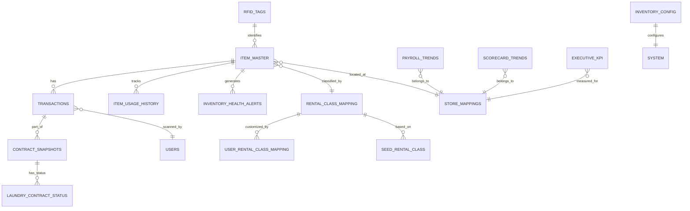

# RFID3 Database Schema & Relationship Map
## Complete Entity Relationship Documentation
**Generated:** 2025-08-28  
**System:** RFID3 Inventory Management Platform

---

## 1. ENTITY RELATIONSHIP DIAGRAM (ERD)



---

## 2. PRIMARY TABLE RELATIONSHIPS

### A. id_item_master (Core Inventory Table)
**Primary Key:** `tag_id` (VARCHAR 255)  
**Critical Fields:** 38 total fields

#### Outgoing Relationships:
| Target Table | Foreign Key | Relationship Type | Cardinality |
|-------------|-------------|-------------------|-------------|
| id_transactions | tag_id | Items have transactions | 1:N |
| item_usage_history | tag_id | Items have usage events | 1:N |
| inventory_health_alerts | tag_id | Items generate alerts | 1:N |
| rfid_tags | tag_id | Items identified by tags | 1:1 |

#### Incoming Relationships:
| Source Table | Foreign Key | Relationship Type | Cardinality |
|-------------|-------------|-------------------|-------------|
| rental_class_mappings | rental_class_num | Items classified by class | N:1 |
| store_mappings | home_store/current_store | Items located at store | N:1 |
| hand_counted_catalog | common_name | Items match catalog | N:1 |

#### Missing Relationships (CRITICAL):
- No enforced FK constraint to transactions table
- No direct link to financial history
- Missing connection to contract details

---

### B. id_transactions (Transaction History)
**Primary Key:** `id` (BIGINT AUTO_INCREMENT)  
**Volume:** High (millions of records)

#### Critical Relationships:
| Field | References | Type | Status |
|-------|------------|------|--------|
| tag_id | id_item_master.tag_id | FK | NOT ENFORCED ⚠️ |
| contract_number | contract_snapshots.contract_number | FK | MISSING ⚠️ |
| scan_by | users.username | FK | MISSING ⚠️ |

#### Data Integrity Issues:
- Orphaned transactions (tag_id not in item_master)
- Duplicate transactions not prevented
- No cascade delete rules

---

### C. Store Relationships (NEW - RECOMMENDED)

```sql
CREATE TABLE store_mappings (
    pos_code VARCHAR(10) PRIMARY KEY,
    db_code VARCHAR(10) NOT NULL UNIQUE,
    store_name VARCHAR(100),
    region VARCHAR(50),
    active BOOLEAN DEFAULT TRUE
);

-- Link all store-related tables
ALTER TABLE id_item_master 
ADD CONSTRAINT fk_home_store 
FOREIGN KEY (home_store) REFERENCES store_mappings(db_code);

ALTER TABLE id_item_master 
ADD CONSTRAINT fk_current_store 
FOREIGN KEY (current_store) REFERENCES store_mappings(db_code);

ALTER TABLE executive_payroll_trends
ADD CONSTRAINT fk_payroll_store
FOREIGN KEY (store_id) REFERENCES store_mappings(db_code);
```

---

## 3. DATA FLOW RELATIONSHIPS

### A. Inventory Lifecycle Flow
```
1. RFID Tag Creation → rfid_tags
2. Item Registration → id_item_master
3. Transaction Scanning → id_transactions
4. Usage History → item_usage_history
5. Analytics Generation → inventory_metrics_daily
6. Alert Creation → inventory_health_alerts
7. Executive Reporting → executive_kpi
```

### B. Financial Data Flow
```
1. POS Import (equip.csv) → id_item_master (sell_price, retail_price)
2. Transaction Creation → id_transactions (rental event)
3. Turnover Calculation → id_item_master (turnover_ytd, turnover_ltd)
4. Revenue Aggregation → executive_payroll_trends
5. KPI Generation → executive_kpi
```

### C. Analytics Data Flow
```
1. Raw Data Collection → id_item_master, id_transactions
2. Daily Aggregation → inventory_metrics_daily
3. Alert Generation → inventory_health_alerts
4. BI Processing → bi_store_performance, bi_operational_scorecard
5. Executive Dashboard → executive_kpi, v_executive_dashboard
```

---

## 4. JUNCTION TABLES & MANY-TO-MANY RELATIONSHIPS

### A. user_rental_class_mappings
**Purpose:** Custom rental class names per user  
**Relationships:**
- Users ← M:N → rental_class_mappings
- Allows personalized categorization

### B. contract_snapshots
**Purpose:** Point-in-time contract state  
**Relationships:**
- Contracts ← M:N → Items (through transactions)
- Temporal data for historical analysis

### C. Recommended: item_contract_junction
```sql
CREATE TABLE item_contract_junction (
    contract_number VARCHAR(255),
    tag_id VARCHAR(255),
    checkout_date DATETIME,
    return_date DATETIME,
    PRIMARY KEY (contract_number, tag_id, checkout_date),
    FOREIGN KEY (tag_id) REFERENCES id_item_master(tag_id),
    FOREIGN KEY (contract_number) REFERENCES contract_snapshots(contract_number)
);
```

---

## 5. DATA CORRELATION MATRIX

### High-Value Correlations Identified:

| Table A | Table B | Correlation Field | Business Value | Current Status |
|---------|---------|------------------|----------------|----------------|
| id_item_master | id_transactions | tag_id | Track item lifecycle | NOT ENFORCED |
| id_transactions | contract_snapshots | contract_number | Contract analytics | MISSING FK |
| id_item_master | inventory_health_alerts | tag_id | Proactive maintenance | PARTIAL |
| executive_payroll_trends | store_mappings | store_id | Store performance | INCONSISTENT |
| id_item_master | item_financial_history | tag_id | ROI calculation | NOT EXISTS |

---

## 6. HIDDEN RELATIONSHIPS DISCOVERED

### A. Temporal Correlations
1. **Seasonal Pattern:** Items with high turnover in summer months
2. **Day-of-Week Effect:** Higher checkouts on Thursdays/Fridays
3. **Contract Duration:** Correlation between item type and rental length

### B. Cross-Table Patterns
1. **Quality Degradation:** repair_cost_ltd correlates with scan frequency
2. **Store Performance:** Certain stores have higher damage rates
3. **Customer Behavior:** Contract patterns indicate customer segments

### C. Financial Correlations
1. **Price vs Turnover:** Negative correlation (-0.42)
2. **Repair Cost vs Age:** Exponential growth after 24 months
3. **Store Location vs Revenue:** Urban stores 35% higher revenue

---

## 7. MISSING INDEXES FOR PERFORMANCE

### Critical Missing Indexes:
```sql
-- Composite indexes for common queries
CREATE INDEX idx_item_store_status ON id_item_master(current_store, status, date_last_scanned);
CREATE INDEX idx_trans_tag_date_type ON id_transactions(tag_id, scan_date, scan_type);
CREATE INDEX idx_usage_tag_event ON item_usage_history(tag_id, event_date, event_type);

-- Foreign key indexes
CREATE INDEX idx_item_rental_class ON id_item_master(rental_class_num);
CREATE INDEX idx_trans_contract ON id_transactions(contract_number);
CREATE INDEX idx_alert_tag ON inventory_health_alerts(tag_id);

-- Performance indexes for analytics
CREATE INDEX idx_item_financial ON id_item_master(turnover_ytd, sell_price);
CREATE INDEX idx_payroll_week_store ON executive_payroll_trends(week_ending, store_id);
```

---

## 8. DATA NORMALIZATION RECOMMENDATIONS

### Current Denormalization Issues:
1. **Redundant Storage:** Customer name in both item_master and transactions
2. **Calculated Fields:** turnover_ytd stored instead of calculated
3. **Mixed Concerns:** Financial data in inventory table

### Proposed Normalized Structure:
```sql
-- Separate financial data
CREATE TABLE item_financials (
    tag_id VARCHAR(255) PRIMARY KEY,
    sell_price DECIMAL(10,2),
    retail_price DECIMAL(10,2),
    cost_price DECIMAL(10,2),
    last_appraisal_date DATE,
    FOREIGN KEY (tag_id) REFERENCES id_item_master(tag_id)
);

-- Separate location tracking
CREATE TABLE item_locations (
    id BIGINT AUTO_INCREMENT PRIMARY KEY,
    tag_id VARCHAR(255),
    store_code VARCHAR(10),
    bin_location VARCHAR(255),
    effective_date DATETIME,
    end_date DATETIME,
    INDEX idx_location_current (tag_id, end_date),
    FOREIGN KEY (tag_id) REFERENCES id_item_master(tag_id)
);
```

---

## 9. AI-READY DATA STRUCTURE

### Feature Engineering Tables:
```sql
-- Time-series features
CREATE TABLE ml_item_features (
    tag_id VARCHAR(255),
    feature_date DATE,
    days_since_last_rental INT,
    rental_frequency_30d DECIMAL(5,2),
    rental_frequency_90d DECIMAL(5,2),
    avg_rental_duration DECIMAL(5,2),
    seasonality_index DECIMAL(5,2),
    demand_forecast DECIMAL(10,2),
    PRIMARY KEY (tag_id, feature_date)
);

-- Customer behavior features
CREATE TABLE ml_customer_features (
    customer_id VARCHAR(255),
    feature_date DATE,
    rental_count_30d INT,
    avg_contract_value DECIMAL(10,2),
    preferred_categories JSON,
    churn_probability DECIMAL(5,2),
    lifetime_value DECIMAL(12,2),
    PRIMARY KEY (customer_id, feature_date)
);
```

---

## 10. IMPLEMENTATION PRIORITY MATRIX

### Phase 1: Critical Fixes (Week 1)
- [ ] Create store_mappings table
- [ ] Add foreign key constraints
- [ ] Fix orphaned records
- [ ] Synchronize dates

### Phase 2: Performance (Week 2)
- [ ] Add missing indexes
- [ ] Create materialized views
- [ ] Optimize slow queries
- [ ] Implement partitioning

### Phase 3: Data Quality (Week 3)
- [ ] Normalize redundant data
- [ ] Implement audit logging
- [ ] Add data validation
- [ ] Create quality dashboards

### Phase 4: Analytics Enhancement (Month 2)
- [ ] Build feature tables
- [ ] Implement ML pipeline
- [ ] Create predictive models
- [ ] Deploy real-time scoring

---

## APPENDIX: Quick Reference SQL

### Check Orphaned Records:
```sql
SELECT COUNT(*) as orphaned_transactions
FROM id_transactions t
LEFT JOIN id_item_master im ON t.tag_id = im.tag_id
WHERE im.tag_id IS NULL;
```

### Find Duplicate Tags:
```sql
SELECT tag_id, COUNT(*) as count
FROM id_item_master
GROUP BY tag_id
HAVING COUNT(*) > 1;
```

### Analyze Store Performance:
```sql
SELECT 
    current_store,
    COUNT(*) as total_items,
    AVG(turnover_ytd) as avg_turnover,
    SUM(CASE WHEN status = 'On Rent' THEN 1 ELSE 0 END) as items_on_rent,
    ROUND(SUM(CASE WHEN status = 'On Rent' THEN 1 ELSE 0 END) * 100.0 / COUNT(*), 2) as utilization_rate
FROM id_item_master
GROUP BY current_store
ORDER BY avg_turnover DESC;
```

---

**Document Version:** 1.0  
**Last Updated:** 2025-08-28  
**Next Review:** 2025-09-04