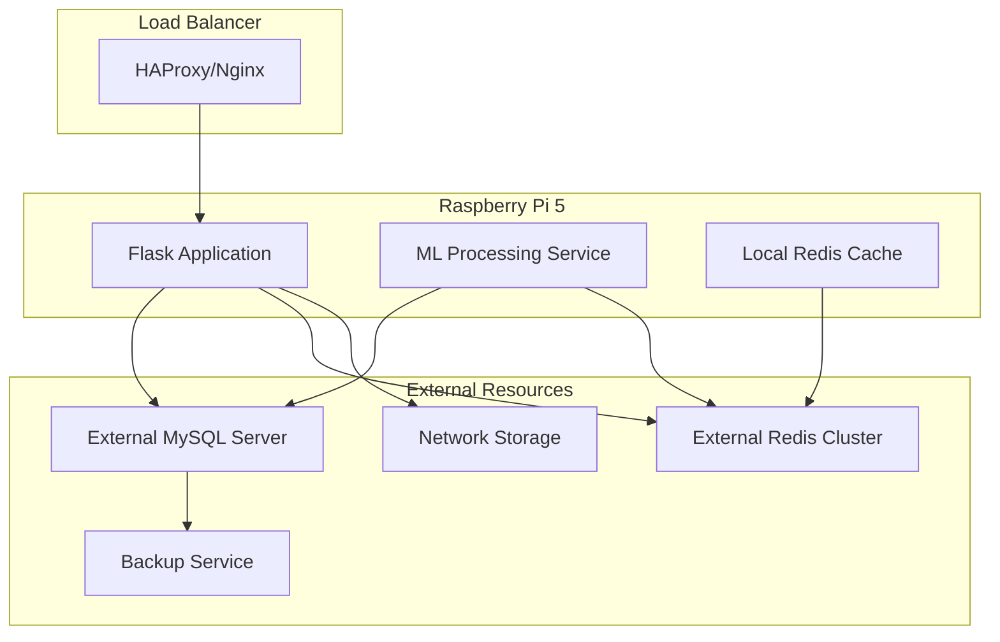

# Deployment & Scaling Strategy for Predictive Analytics
**Version**: 1.0  
**Date**: August 31, 2025  
**Environment**: Raspberry Pi 5 with Growth Path to Multi-Node

## 🚀 Deployment Strategy Overview

### Deployment Phases
1. **Phase 1**: Single Pi 5 Foundation (Current → 100k records)
2. **Phase 2**: Pi 5 with External Resources (100k → 250k records)  
3. **Phase 3**: Multi-Pi Cluster (250k → 500k records)
4. **Phase 4**: Hybrid Cloud Migration (500k+ records)

### Business Continuity Requirements
- **Zero-downtime deployments** for production updates
- **Automatic failover** within 30 seconds
- **Data backup** every 4 hours with point-in-time recovery
- **Rollback capability** within 5 minutes
- **Performance SLA**: <2 second API response times maintained during scaling

---

## 📋 Phase 1: Single Pi 5 Foundation

### Current System Deployment

```yaml
# docker-compose.production.yml
version: '3.8'

services:
  rfid-app:
    image: rfid3:latest
    container_name: rfid3_app
    ports:
      - "5000:5000"
    environment:
      - FLASK_ENV=production
      - DB_HOST=mysql
      - REDIS_HOST=redis
      - ML_WORKERS=2
    volumes:
      - ./app:/app
      - ./models:/app/models
      - ./logs:/app/logs
    depends_on:
      - mysql
      - redis
    restart: unless-stopped
    deploy:
      resources:
        limits:
          memory: 2G
          cpus: '2.0'
    healthcheck:
      test: ["CMD", "curl", "-f", "http://localhost:5000/health"]
      interval: 30s
      timeout: 10s
      retries: 3

  mysql:
    image: mysql:8.0-arm64v8
    container_name: rfid3_mysql
    environment:
      - MYSQL_ROOT_PASSWORD=${MYSQL_ROOT_PASSWORD}
      - MYSQL_DATABASE=rfid_inventory
      - MYSQL_USER=rfid_user  
      - MYSQL_PASSWORD=${MYSQL_PASSWORD}
    ports:
      - "3306:3306"
    volumes:
      - mysql_data:/var/lib/mysql
      - ./mysql.conf:/etc/mysql/conf.d/custom.cnf
    restart: unless-stopped
    deploy:
      resources:
        limits:
          memory: 2G
          cpus: '1.5'

  redis:
    image: redis:7-alpine
    container_name: rfid3_redis
    ports:
      - "6379:6379"
    volumes:
      - redis_data:/data
      - ./redis.conf:/etc/redis/redis.conf
    restart: unless-stopped
    deploy:
      resources:
        limits:
          memory: 1.5G
          cpus: '0.5'
    command: redis-server /etc/redis/redis.conf

  nginx:
    image: nginx:alpine
    container_name: rfid3_nginx
    ports:
      - "80:80"
      - "443:443"
    volumes:
      - ./nginx.conf:/etc/nginx/nginx.conf
      - ./ssl:/etc/nginx/ssl
      - ./static:/var/www/static
    depends_on:
      - rfid-app
    restart: unless-stopped

  ml-worker:
    image: rfid3:latest
    container_name: rfid3_ml_worker
    command: celery -A app.ml_celery worker --loglevel=info --concurrency=2
    environment:
      - CELERY_BROKER_URL=redis://redis:6379/1
      - DB_HOST=mysql
    volumes:
      - ./app:/app
      - ./models:/app/models
    depends_on:
      - redis
      - mysql
    restart: unless-stopped
    deploy:
      resources:
        limits:
          memory: 1.5G
          cpus: '1.0'

  prometheus:
    image: prom/prometheus:latest
    container_name: rfid3_prometheus
    ports:
      - "9090:9090"
    volumes:
      - ./monitoring/prometheus.yml:/etc/prometheus/prometheus.yml
      - prometheus_data:/prometheus
    restart: unless-stopped

volumes:
  mysql_data:
  redis_data:
  prometheus_data:
```

### Deployment Scripts

```bash
#!/bin/bash
# deploy.sh - Production deployment script

set -e

echo "🚀 Starting RFID3 Predictive Analytics deployment..."

# Pre-deployment checks
echo "📋 Running pre-deployment checks..."
./scripts/pre-deployment-checks.sh

# Backup current database
echo "💾 Creating database backup..."
./scripts/backup-database.sh

# Build new images
echo "🔨 Building Docker images..."
docker-compose -f docker-compose.production.yml build --no-cache

# Run database migrations
echo "🗄️  Running database migrations..."
docker-compose -f docker-compose.production.yml run --rm rfid-app python -m flask db upgrade

# Deploy with rolling update
echo "🔄 Deploying with zero downtime..."
docker-compose -f docker-compose.production.yml up -d --remove-orphans

# Health checks
echo "🏥 Running health checks..."
./scripts/health-check.sh

# Performance validation
echo "⚡ Validating performance..."
./scripts/performance-check.sh

echo "✅ Deployment completed successfully!"
```

### Performance Configuration

```python
# /app/config/production.py
PRODUCTION_CONFIG = {
    "flask": {
        "workers": 2,                    # Pi 5 has 4 cores
        "worker_class": "gevent",
        "worker_connections": 50,
        "max_requests": 1000,
        "max_requests_jitter": 100,
        "timeout": 30,
        "keepalive": 2
    },
    "mysql": {
        "pool_size": 5,
        "max_overflow": 10,
        "pool_timeout": 30,
        "pool_recycle": 3600
    },
    "redis": {
        "connection_pool_max": 10,
        "socket_timeout": 30,
        "socket_connect_timeout": 30
    },
    "ml_processing": {
        "max_concurrent_predictions": 5,
        "batch_size": 100,
        "model_cache_size": 3,
        "feature_cache_ttl": 300
    }
}
```

---

## 📈 Phase 2: Pi 5 with External Resources

### Architecture Enhancement



### External Database Configuration

```yaml
# external-mysql.yml
version: '3.8'

services:
  mysql-primary:
    image: mysql:8.0
    environment:
      - MYSQL_ROOT_PASSWORD=${MYSQL_ROOT_PASSWORD}
      - MYSQL_DATABASE=rfid_inventory
    ports:
      - "3306:3306"
    volumes:
      - mysql_primary_data:/var/lib/mysql
      - ./mysql-primary.cnf:/etc/mysql/conf.d/mysql.cnf
    deploy:
      resources:
        limits:
          memory: 8G
          cpus: '4.0'

  mysql-replica:
    image: mysql:8.0
    environment:
      - MYSQL_ROOT_PASSWORD=${MYSQL_ROOT_PASSWORD}
      - MYSQL_DATABASE=rfid_inventory
    ports:
      - "3307:3306"
    volumes:
      - mysql_replica_data:/var/lib/mysql
      - ./mysql-replica.cnf:/etc/mysql/conf.d/mysql.cnf
    depends_on:
      - mysql-primary
    deploy:
      resources:
        limits:
          memory: 8G
          cpus: '4.0'

  redis-cluster:
    image: redis:7
    ports:
      - "6379:6379"
      - "16379:16379"
    volumes:
      - redis_cluster_data:/data
    deploy:
      resources:
        limits:
          memory: 4G
          cpus: '2.0'
    command: redis-server --cluster-enabled yes --cluster-config-file nodes.conf

volumes:
  mysql_primary_data:
  mysql_replica_data:
  redis_cluster_data:
```

### Load Balancing Configuration

```nginx
# nginx-load-balancer.conf
upstream rfid_backend {
    least_conn;
    server pi5-node1:5000 weight=3 max_fails=3 fail_timeout=30s;
    server pi5-node2:5000 weight=2 max_fails=3 fail_timeout=30s backup;
}

server {
    listen 80;
    server_name predictive-analytics.local;

    location /api/predictive/ {
        proxy_pass http://rfid_backend;
        proxy_set_header Host $host;
        proxy_set_header X-Real-IP $remote_addr;
        proxy_set_header X-Forwarded-For $proxy_add_x_forwarded_for;
        proxy_connect_timeout 30s;
        proxy_send_timeout 30s;
        proxy_read_timeout 30s;
        
        # Caching for GET requests
        proxy_cache predictive_cache;
        proxy_cache_valid 200 5m;
        proxy_cache_key "$request_method$request_uri";
        proxy_cache_bypass $http_cache_control;
    }

    location /health {
        proxy_pass http://rfid_backend;
        access_log off;
    }
}

proxy_cache_path /var/cache/nginx/predictive levels=1:2 keys_zone=predictive_cache:100m max_size=1g inactive=60m;
```

---

## 🏗️ Phase 3: Multi-Pi Cluster Architecture

### Kubernetes Cluster on Pi

```yaml
# k3s-cluster.yml
apiVersion: v1
kind: ConfigMap
metadata:
  name: rfid3-config
data:
  FLASK_ENV: "production"
  DB_HOST: "mysql-service"
  REDIS_HOST: "redis-service"
  ML_WORKERS: "2"

---
apiVersion: apps/v1
kind: Deployment
metadata:
  name: rfid3-app
spec:
  replicas: 3
  selector:
    matchLabels:
      app: rfid3-app
  template:
    metadata:
      labels:
        app: rfid3-app
    spec:
      containers:
      - name: rfid3
        image: rfid3:latest
        ports:
        - containerPort: 5000
        env:
        - name: FLASK_ENV
          valueFrom:
            configMapKeyRef:
              name: rfid3-config
              key: FLASK_ENV
        resources:
          requests:
            memory: "1Gi"
            cpu: "500m"
          limits:
            memory: "2Gi"
            cpu: "1"
        readinessProbe:
          httpGet:
            path: /health
            port: 5000
          initialDelaySeconds: 30
          periodSeconds: 10
        livenessProbe:
          httpGet:
            path: /health
            port: 5000
          initialDelaySeconds: 60
          periodSeconds: 30

---
apiVersion: v1
kind: Service
metadata:
  name: rfid3-service
spec:
  selector:
    app: rfid3-app
  ports:
  - port: 80
    targetPort: 5000
  type: LoadBalancer

---
apiVersion: apps/v1
kind: StatefulSet
metadata:
  name: mysql
spec:
  serviceName: mysql-service
  replicas: 1
  selector:
    matchLabels:
      app: mysql
  template:
    metadata:
      labels:
        app: mysql
    spec:
      containers:
      - name: mysql
        image: mysql:8.0-arm64v8
        ports:
        - containerPort: 3306
        env:
        - name: MYSQL_ROOT_PASSWORD
          valueFrom:
            secretKeyRef:
              name: mysql-secret
              key: root-password
        volumeMounts:
        - name: mysql-storage
          mountPath: /var/lib/mysql
        resources:
          requests:
            memory: "2Gi"
            cpu: "1"
          limits:
            memory: "4Gi"
            cpu: "2"
  volumeClaimTemplates:
  - metadata:
      name: mysql-storage
    spec:
      accessModes: ["ReadWriteOnce"]
      resources:
        requests:
          storage: 100Gi

---
apiVersion: batch/v1
kind: CronJob
metadata:
  name: model-training
spec:
  schedule: "0 2 * * *"  # Daily at 2 AM
  jobTemplate:
    spec:
      template:
        spec:
          containers:
          - name: model-trainer
            image: rfid3:latest
            command:
            - python
            - -m
            - app.ml_training.train_all_models
            resources:
              requests:
                memory: "2Gi"
                cpu: "1"
              limits:
                memory: "4Gi"
                cpu: "2"
          restartPolicy: OnFailure
```

### Cluster Management Scripts

```bash
#!/bin/bash
# cluster-setup.sh

echo "🏗️  Setting up K3s cluster on Raspberry Pi nodes..."

# Master node setup
if [ "$1" == "master" ]; then
    echo "🎯 Configuring master node..."
    curl -sfL https://get.k3s.io | INSTALL_K3S_EXEC="--disable traefik" sh -
    
    # Get node token
    sudo cat /var/lib/rancher/k3s/server/node-token > node-token
    echo "📝 Node token saved to node-token file"
    
    # Install monitoring
    kubectl apply -f monitoring/prometheus-operator.yml
    kubectl apply -f monitoring/grafana.yml

# Worker node setup
elif [ "$1" == "worker" ]; then
    echo "👥 Configuring worker node..."
    if [ -z "$2" ] || [ -z "$3" ]; then
        echo "Usage: $0 worker <master-ip> <node-token>"
        exit 1
    fi
    
    curl -sfL https://get.k3s.io | K3S_URL=https://$2:6443 K3S_TOKEN=$3 sh -
    
else
    echo "Usage: $0 {master|worker} [master-ip] [node-token]"
    exit 1
fi

echo "✅ Cluster setup completed!"
```

### Auto-scaling Configuration

```yaml
# horizontal-pod-autoscaler.yml
apiVersion: autoscaling/v2
kind: HorizontalPodAutoscaler
metadata:
  name: rfid3-hpa
spec:
  scaleTargetRef:
    apiVersion: apps/v1
    kind: Deployment
    name: rfid3-app
  minReplicas: 2
  maxReplicas: 6
  metrics:
  - type: Resource
    resource:
      name: cpu
      target:
        type: Utilization
        averageUtilization: 70
  - type: Resource
    resource:
      name: memory
      target:
        type: Utilization
        averageUtilization: 80
  behavior:
    scaleDown:
      stabilizationWindowSeconds: 300
      policies:
      - type: Percent
        value: 50
        periodSeconds: 60
    scaleUp:
      stabilizationWindowSeconds: 60
      policies:
      - type: Percent
        value: 100
        periodSeconds: 60
```

---

## ☁️ Phase 4: Hybrid Cloud Migration

### Cloud Migration Strategy

```python
# /app/services/cloud_migration/migration_manager.py
from typing import Dict, Any, List
import asyncio
import boto3

class CloudMigrationManager:
    """Manage gradual migration to cloud infrastructure"""
    
    def __init__(self):
        self.migration_phases = [
            "backup_and_storage",
            "database_migration", 
            "cache_layer_migration",
            "ml_model_migration",
            "application_migration"
        ]
        self.current_phase = "backup_and_storage"
        
    async def execute_migration_phase(self, phase: str) -> Dict[str, Any]:
        """Execute specific migration phase"""
        if phase == "backup_and_storage":
            return await self._migrate_backup_to_s3()
        elif phase == "database_migration":
            return await self._migrate_database_to_rds()
        elif phase == "cache_layer_migration":
            return await self._migrate_cache_to_elasticache()
        elif phase == "ml_model_migration":
            return await self._migrate_models_to_sagemaker()
        elif phase == "application_migration":
            return await self._migrate_app_to_ecs()
        else:
            raise ValueError(f"Unknown migration phase: {phase}")
    
    async def _migrate_backup_to_s3(self) -> Dict[str, Any]:
        """Migrate backup system to S3"""
        s3_client = boto3.client('s3')
        
        # Create backup bucket
        bucket_name = "rfid3-predictive-backups"
        try:
            s3_client.create_bucket(Bucket=bucket_name)
        except s3_client.exceptions.BucketAlreadyExists:
            pass
        
        # Set up backup lifecycle
        lifecycle_config = {
            'Rules': [
                {
                    'ID': 'backup-lifecycle',
                    'Status': 'Enabled',
                    'Filter': {'Prefix': 'database-backups/'},
                    'Transitions': [
                        {
                            'Days': 30,
                            'StorageClass': 'STANDARD_IA'
                        },
                        {
                            'Days': 90, 
                            'StorageClass': 'GLACIER'
                        }
                    ]
                }
            ]
        }
        
        s3_client.put_bucket_lifecycle_configuration(
            Bucket=bucket_name,
            LifecycleConfiguration=lifecycle_config
        )
        
        return {
            "phase": "backup_and_storage",
            "status": "completed",
            "bucket_name": bucket_name,
            "cost_estimate_monthly": 25.0
        }
    
    async def _migrate_database_to_rds(self) -> Dict[str, Any]:
        """Migrate MySQL to Amazon RDS"""
        rds_client = boto3.client('rds')
        
        # Create RDS instance
        db_config = {
            'DBInstanceIdentifier': 'rfid3-predictive-db',
            'DBInstanceClass': 'db.t3.medium',
            'Engine': 'mysql',
            'EngineVersion': '8.0',
            'AllocatedStorage': 100,
            'StorageType': 'gp2',
            'StorageEncrypted': True,
            'MultiAZ': True,
            'PubliclyAccessible': False,
            'BackupRetentionPeriod': 7,
            'PreferredBackupWindow': '02:00-03:00',
            'PreferredMaintenanceWindow': 'sun:03:00-sun:04:00'
        }
        
        try:
            response = rds_client.create_db_instance(**db_config)
            
            return {
                "phase": "database_migration",
                "status": "in_progress",
                "db_instance_id": db_config['DBInstanceIdentifier'],
                "estimated_completion": "30 minutes",
                "cost_estimate_monthly": 45.0
            }
        except Exception as e:
            return {
                "phase": "database_migration", 
                "status": "failed",
                "error": str(e)
            }

    def get_migration_roadmap(self) -> List[Dict[str, Any]]:
        """Get complete migration roadmap with timelines and costs"""
        return [
            {
                "phase": "backup_and_storage",
                "timeline": "1 day",
                "cost_monthly": 25.0,
                "risk_level": "low",
                "prerequisites": [],
                "rollback_time": "immediate"
            },
            {
                "phase": "database_migration",
                "timeline": "1 week",
                "cost_monthly": 45.0,
                "risk_level": "medium",
                "prerequisites": ["backup_and_storage"],
                "rollback_time": "2 hours"
            },
            {
                "phase": "cache_layer_migration",
                "timeline": "3 days",
                "cost_monthly": 35.0,
                "risk_level": "low",
                "prerequisites": ["database_migration"],
                "rollback_time": "30 minutes"
            },
            {
                "phase": "ml_model_migration",
                "timeline": "1 week",
                "cost_monthly": 150.0,
                "risk_level": "high",
                "prerequisites": ["cache_layer_migration"],
                "rollback_time": "4 hours"
            },
            {
                "phase": "application_migration",
                "timeline": "2 weeks", 
                "cost_monthly": 200.0,
                "risk_level": "high",
                "prerequisites": ["ml_model_migration"],
                "rollback_time": "8 hours"
            }
        ]
```

### Terraform Infrastructure

```hcl
# infrastructure/main.tf
terraform {
  required_providers {
    aws = {
      source  = "hashicorp/aws"
      version = "~> 5.0"
    }
  }
}

provider "aws" {
  region = var.aws_region
}

# VPC Configuration
module "vpc" {
  source = "terraform-aws-modules/vpc/aws"

  name = "rfid3-predictive-vpc"
  cidr = "10.0.0.0/16"

  azs             = ["${var.aws_region}a", "${var.aws_region}b", "${var.aws_region}c"]
  private_subnets = ["10.0.1.0/24", "10.0.2.0/24", "10.0.3.0/24"]
  public_subnets  = ["10.0.101.0/24", "10.0.102.0/24", "10.0.103.0/24"]

  enable_nat_gateway = true
  enable_vpn_gateway = true
  enable_dns_hostnames = true
  enable_dns_support = true

  tags = {
    Environment = "production"
    Project     = "rfid3-predictive"
  }
}

# RDS Database
resource "aws_db_instance" "main" {
  identifier = "rfid3-predictive-db"
  
  engine         = "mysql"
  engine_version = "8.0"
  instance_class = "db.t3.medium"
  
  allocated_storage     = 100
  max_allocated_storage = 500
  storage_type         = "gp2"
  storage_encrypted    = true
  
  db_name  = "rfid_inventory"
  username = var.db_username
  password = var.db_password
  
  vpc_security_group_ids = [aws_security_group.rds.id]
  db_subnet_group_name   = aws_db_subnet_group.main.name
  
  backup_retention_period = 7
  backup_window          = "02:00-03:00"
  maintenance_window     = "sun:03:00-sun:04:00"
  
  skip_final_snapshot = false
  final_snapshot_identifier = "rfid3-final-snapshot"
  
  multi_az = true
  
  tags = {
    Name = "rfid3-predictive-database"
    Environment = "production"
  }
}

# ECS Cluster
resource "aws_ecs_cluster" "main" {
  name = "rfid3-predictive-cluster"
  
  capacity_providers = ["FARGATE", "FARGATE_SPOT"]
  
  default_capacity_provider_strategy {
    capacity_provider = "FARGATE"
    weight           = 1
    base             = 1
  }
  
  setting {
    name  = "containerInsights"
    value = "enabled"
  }
  
  tags = {
    Environment = "production"
    Project     = "rfid3-predictive"
  }
}

# Application Load Balancer
resource "aws_lb" "main" {
  name               = "rfid3-predictive-alb"
  internal           = false
  load_balancer_type = "application"
  security_groups    = [aws_security_group.alb.id]
  subnets           = module.vpc.public_subnets

  enable_deletion_protection = false

  tags = {
    Environment = "production"
    Project     = "rfid3-predictive"
  }
}

# Auto Scaling
resource "aws_appautoscaling_target" "ecs_target" {
  max_capacity       = 10
  min_capacity       = 2
  resource_id        = "service/${aws_ecs_cluster.main.name}/${aws_ecs_service.main.name}"
  scalable_dimension = "ecs:service:DesiredCount"
  service_namespace  = "ecs"
}

resource "aws_appautoscaling_policy" "scale_up" {
  name               = "scale-up"
  policy_type        = "TargetTrackingScaling"
  resource_id        = aws_appautoscaling_target.ecs_target.resource_id
  scalable_dimension = aws_appautoscaling_target.ecs_target.scalable_dimension
  service_namespace  = aws_appautoscaling_target.ecs_target.service_namespace

  target_tracking_scaling_policy_configuration {
    target_value = 70.0
    predefined_metric_specification {
      predefined_metric_type = "ECSServiceAverageCPUUtilization"
    }
    scale_out_cooldown = 300
    scale_in_cooldown  = 300
  }
}
```

---

## 📊 Scaling Decision Matrix

### Automatic Scaling Triggers

| Metric | Threshold | Action | Timeline |
|--------|-----------|--------|----------|
| CPU Usage | >75% for 5 minutes | Scale up by 50% | 2 minutes |
| Memory Usage | >80% for 3 minutes | Scale up by 25% | 1 minute |
| API Response Time | >1.5s for 2 minutes | Scale up immediately | 30 seconds |
| Queue Length | >100 pending requests | Add worker nodes | 1 minute |
| Error Rate | >1% for 5 minutes | Emergency scaling + alerts | 30 seconds |

### Scaling Decision Algorithm

```python
# /app/services/scaling/scaling_decision_engine.py
from dataclasses import dataclass
from typing import Dict, Any, List
from enum import Enum

class ScalingAction(Enum):
    SCALE_UP = "scale_up"
    SCALE_DOWN = "scale_down"
    NO_ACTION = "no_action"
    EMERGENCY_SCALE = "emergency_scale"

@dataclass
class ScalingDecision:
    action: ScalingAction
    target_capacity: int
    reason: str
    urgency: str
    estimated_cost_impact: float

class ScalingDecisionEngine:
    """Intelligent scaling decision making"""
    
    def __init__(self):
        self.scaling_rules = {
            "cpu_threshold": 0.75,
            "memory_threshold": 0.80,
            "response_time_threshold": 1500,  # ms
            "error_rate_threshold": 0.01,
            "min_instances": 2,
            "max_instances": 10
        }
        
    async def make_scaling_decision(self, metrics: Dict[str, Any]) -> ScalingDecision:
        """Make intelligent scaling decision based on current metrics"""
        current_capacity = metrics.get("current_instances", 2)
        
        # Emergency scaling conditions
        if self._is_emergency_condition(metrics):
            return ScalingDecision(
                action=ScalingAction.EMERGENCY_SCALE,
                target_capacity=min(current_capacity * 2, self.scaling_rules["max_instances"]),
                reason="Emergency scaling due to critical metrics",
                urgency="critical",
                estimated_cost_impact=self._calculate_cost_impact(current_capacity * 2)
            )
        
        # Calculate scaling score
        scaling_score = self._calculate_scaling_score(metrics)
        
        if scaling_score > 0.7:  # Scale up
            new_capacity = min(
                current_capacity + max(1, int(current_capacity * 0.5)),
                self.scaling_rules["max_instances"]
            )
            return ScalingDecision(
                action=ScalingAction.SCALE_UP,
                target_capacity=new_capacity,
                reason=f"High demand detected (score: {scaling_score:.2f})",
                urgency="high",
                estimated_cost_impact=self._calculate_cost_impact(new_capacity)
            )
            
        elif scaling_score < -0.5:  # Scale down
            new_capacity = max(
                current_capacity - 1,
                self.scaling_rules["min_instances"]
            )
            return ScalingDecision(
                action=ScalingAction.SCALE_DOWN,
                target_capacity=new_capacity,
                reason=f"Low demand detected (score: {scaling_score:.2f})",
                urgency="low",
                estimated_cost_impact=self._calculate_cost_impact(new_capacity)
            )
        
        return ScalingDecision(
            action=ScalingAction.NO_ACTION,
            target_capacity=current_capacity,
            reason="Metrics within acceptable range",
            urgency="none",
            estimated_cost_impact=0.0
        )
    
    def _calculate_scaling_score(self, metrics: Dict[str, Any]) -> float:
        """Calculate composite scaling score"""
        score = 0.0
        
        # CPU utilization component
        cpu_util = metrics.get("cpu_percent", 0) / 100.0
        if cpu_util > self.scaling_rules["cpu_threshold"]:
            score += (cpu_util - self.scaling_rules["cpu_threshold"]) * 2
        elif cpu_util < 0.3:
            score -= (0.3 - cpu_util) * 1
        
        # Memory utilization component
        memory_util = metrics.get("memory_percent", 0) / 100.0
        if memory_util > self.scaling_rules["memory_threshold"]:
            score += (memory_util - self.scaling_rules["memory_threshold"]) * 1.5
        elif memory_util < 0.4:
            score -= (0.4 - memory_util) * 0.5
        
        # Response time component
        response_time = metrics.get("avg_response_time_ms", 0)
        if response_time > self.scaling_rules["response_time_threshold"]:
            score += (response_time - self.scaling_rules["response_time_threshold"]) / 500.0
        
        # Queue length component
        queue_length = metrics.get("queue_length", 0)
        if queue_length > 50:
            score += queue_length / 100.0
        
        return max(-1.0, min(1.0, score))  # Clamp between -1 and 1
    
    def _is_emergency_condition(self, metrics: Dict[str, Any]) -> bool:
        """Check if emergency scaling is needed"""
        conditions = [
            metrics.get("cpu_percent", 0) > 90,
            metrics.get("memory_percent", 0) > 95,
            metrics.get("avg_response_time_ms", 0) > 5000,
            metrics.get("error_rate", 0) > 0.05,
            metrics.get("queue_length", 0) > 500
        ]
        
        return any(conditions)
```

---

## 🔄 Continuous Deployment Pipeline

### GitOps Workflow

```yaml
# .github/workflows/deploy-production.yml
name: Deploy to Production

on:
  push:
    branches: [ main ]
    paths:
      - 'app/**'
      - 'requirements.txt'
      - 'Dockerfile'

jobs:
  test:
    runs-on: ubuntu-latest
    steps:
    - uses: actions/checkout@v3
    
    - name: Set up Python
      uses: actions/setup-python@v4
      with:
        python-version: '3.9'
    
    - name: Install dependencies
      run: |
        pip install -r requirements.txt
        pip install pytest pytest-cov
    
    - name: Run tests
      run: |
        pytest tests/ --cov=app --cov-report=xml
    
    - name: Performance tests
      run: |
        python tests/performance_tests.py

  build:
    needs: test
    runs-on: ubuntu-latest
    steps:
    - uses: actions/checkout@v3
    
    - name: Build Docker image
      run: |
        docker build -t rfid3:${{ github.sha }} .
        docker tag rfid3:${{ github.sha }} rfid3:latest
    
    - name: Security scan
      run: |
        docker run --rm -v /var/run/docker.sock:/var/run/docker.sock \
          -v $HOME/.cache:/tmp/.cache/ aquasec/trivy:latest \
          image rfid3:latest

  deploy-staging:
    needs: build
    runs-on: self-hosted  # Pi 5 runner
    environment: staging
    steps:
    - uses: actions/checkout@v3
    
    - name: Deploy to staging
      run: |
        docker-compose -f docker-compose.staging.yml down
        docker-compose -f docker-compose.staging.yml pull
        docker-compose -f docker-compose.staging.yml up -d
    
    - name: Health check
      run: |
        sleep 30
        curl -f http://staging.rfid3.local/health

  deploy-production:
    needs: deploy-staging
    runs-on: self-hosted  # Pi 5 runner
    environment: production
    steps:
    - uses: actions/checkout@v3
    
    - name: Blue-Green deployment
      run: |
        ./scripts/blue-green-deploy.sh rfid3:${{ github.sha }}
    
    - name: Production health check
      run: |
        ./scripts/comprehensive-health-check.sh
    
    - name: Rollback on failure
      if: failure()
      run: |
        ./scripts/rollback-deployment.sh
```

This comprehensive deployment and scaling strategy ensures the RFID3 predictive analytics system can grow seamlessly from a single Pi 5 to a full cloud-native architecture while maintaining performance, reliability, and cost efficiency.