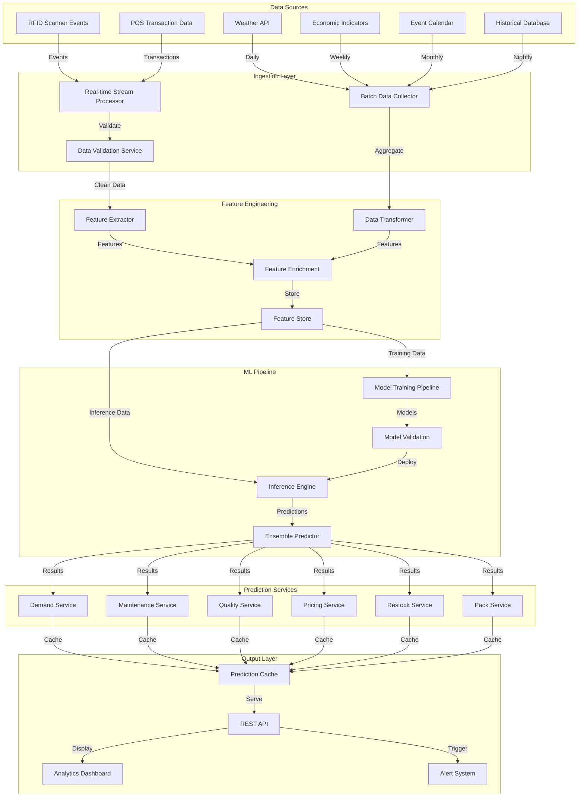

# ML Pipeline & Data Flow Architecture
**Version**: 1.0  
**Date**: August 31, 2025  
**Environment**: Raspberry Pi 5 Production System

## 🔄 Data Flow Overview



---

## 📊 Feature Engineering Pipeline

### 1. Real-time Feature Extraction

```python
# /app/services/feature_engineering/realtime_extractor.py
from typing import Dict, Any, List
from datetime import datetime, timedelta
import pandas as pd
import numpy as np
from dataclasses import dataclass

@dataclass
class FeatureVector:
    entity_id: str
    feature_name: str
    feature_value: float
    feature_type: str
    timestamp: datetime
    confidence: float = 1.0
    source: str = "unknown"

class RealtimeFeatureExtractor:
    """Extract features from real-time data streams"""
    
    def __init__(self):
        self.logger = get_logger("feature_extractor")
        self.feature_cache = {}
        self.aggregation_windows = {
            "1min": timedelta(minutes=1),
            "5min": timedelta(minutes=5), 
            "1hour": timedelta(hours=1),
            "1day": timedelta(days=1)
        }
    
    async def extract_rfid_features(self, scan_event: Dict[str, Any]) -> List[FeatureVector]:
        """Extract features from RFID scan events"""
        features = []
        tag_id = scan_event.get("tag_id")
        scan_type = scan_event.get("scan_type")
        timestamp = scan_event.get("scan_date")
        
        # Basic event features
        features.append(FeatureVector(
            entity_id=tag_id,
            feature_name="last_scan_type",
            feature_value=self._encode_scan_type(scan_type),
            feature_type="categorical",
            timestamp=timestamp,
            source="rfid"
        ))
        
        # Time-based features
        hour_of_day = timestamp.hour
        day_of_week = timestamp.weekday()
        
        features.extend([
            FeatureVector(tag_id, "scan_hour", hour_of_day, "temporal", timestamp, source="rfid"),
            FeatureVector(tag_id, "scan_day_of_week", day_of_week, "temporal", timestamp, source="rfid")
        ])
        
        # Usage frequency features
        usage_freq = await self._calculate_usage_frequency(tag_id, timestamp)
        features.append(FeatureVector(
            tag_id, "usage_frequency_7d", usage_freq, "behavioral", timestamp, source="rfid"
        ))
        
        # Quality transition features
        if scan_type == "return":
            quality_change = await self._calculate_quality_change(tag_id, scan_event)
            features.append(FeatureVector(
                tag_id, "quality_degradation_rate", quality_change, "quality", timestamp, source="rfid"
            ))
        
        return features
    
    async def extract_pos_features(self, transaction: Dict[str, Any]) -> List[FeatureVector]:
        """Extract features from POS transactions"""
        features = []
        transaction_id = transaction.get("transaction_id")
        items = transaction.get("items", [])
        total_amount = transaction.get("total_amount", 0)
        timestamp = transaction.get("transaction_date")
        
        # Transaction-level features
        features.extend([
            FeatureVector(transaction_id, "transaction_value", total_amount, "financial", timestamp, source="pos"),
            FeatureVector(transaction_id, "item_count", len(items), "behavioral", timestamp, source="pos"),
            FeatureVector(transaction_id, "avg_item_value", total_amount / max(1, len(items)), "financial", timestamp, source="pos")
        ])
        
        # Item-level features
        for item in items:
            item_id = item.get("item_id")
            quantity = item.get("quantity", 1)
            price = item.get("price", 0)
            
            features.extend([
                FeatureVector(item_id, "rental_price", price, "financial", timestamp, source="pos"),
                FeatureVector(item_id, "rental_quantity", quantity, "demand", timestamp, source="pos"),
                FeatureVector(item_id, "revenue_contribution", price * quantity, "financial", timestamp, source="pos")
            ])
        
        return features
    
    async def extract_external_features(self, external_data: Dict[str, Any]) -> List[FeatureVector]:
        """Extract features from external data sources"""
        features = []
        timestamp = datetime.now()
        
        # Weather features
        if "weather" in external_data:
            weather = external_data["weather"]
            features.extend([
                FeatureVector("global", "temperature_f", weather.get("temperature", 70), "environmental", timestamp, source="weather_api"),
                FeatureVector("global", "humidity_pct", weather.get("humidity", 50), "environmental", timestamp, source="weather_api"),
                FeatureVector("global", "precipitation_in", weather.get("precipitation", 0), "environmental", timestamp, source="weather_api")
            ])
        
        # Economic features
        if "economic" in external_data:
            econ = external_data["economic"]
            features.extend([
                FeatureVector("global", "consumer_confidence", econ.get("consumer_confidence", 100), "economic", timestamp, source="economic_api"),
                FeatureVector("global", "unemployment_rate", econ.get("unemployment", 5.0), "economic", timestamp, source="economic_api"),
                FeatureVector("global", "interest_rate", econ.get("interest_rate", 3.0), "economic", timestamp, source="economic_api")
            ])
        
        # Seasonal features
        month = timestamp.month
        is_wedding_season = month in [5, 6, 7, 8, 9]
        is_holiday_season = month in [11, 12]
        
        features.extend([
            FeatureVector("global", "is_wedding_season", float(is_wedding_season), "seasonal", timestamp, source="calendar"),
            FeatureVector("global", "is_holiday_season", float(is_holiday_season), "seasonal", timestamp, source="calendar"),
            FeatureVector("global", "month_of_year", month, "temporal", timestamp, source="system")
        ])
        
        return features
    
    def _encode_scan_type(self, scan_type: str) -> float:
        """Encode scan types numerically"""
        encoding = {"in": 1.0, "out": 2.0, "return": 3.0, "damage": 4.0, "repair": 5.0}
        return encoding.get(scan_type.lower(), 0.0)
    
    async def _calculate_usage_frequency(self, item_id: str, current_time: datetime) -> float:
        """Calculate item usage frequency over last 7 days"""
        # Query database for usage events in last 7 days
        # For now, return sample calculation
        return np.random.uniform(0.1, 2.0)  # Usage per day
    
    async def _calculate_quality_change(self, item_id: str, scan_event: Dict[str, Any]) -> float:
        """Calculate quality degradation rate"""
        # Compare current quality with previous scan
        # Return rate of change
        return np.random.uniform(-0.05, 0.0)  # Negative indicates degradation
```

### 2. Feature Store Implementation

```python
# /app/services/feature_engineering/feature_store.py
from sqlalchemy import text
from typing import List, Dict, Optional
import asyncio
from datetime import datetime, timedelta

class FeatureStore:
    """Centralized feature storage and retrieval system"""
    
    def __init__(self):
        self.logger = get_logger("feature_store")
        self.cache = cache
        self.db = db
        
    async def store_features(self, features: List[FeatureVector]) -> bool:
        """Store feature vectors in database and cache"""
        try:
            # Batch insert to database
            await self._batch_insert_features(features)
            
            # Update cache for real-time access
            await self._cache_latest_features(features)
            
            return True
            
        except Exception as e:
            self.logger.error(f"Feature storage failed: {e}")
            return False
    
    async def get_features(self, entity_id: str, feature_names: List[str], 
                          time_window: timedelta = timedelta(hours=1)) -> Dict[str, FeatureVector]:
        """Retrieve features for entity within time window"""
        try:
            # Try cache first
            cached_features = await self._get_cached_features(entity_id, feature_names)
            if cached_features:
                return cached_features
            
            # Query database
            features = await self._query_features(entity_id, feature_names, time_window)
            
            # Cache results
            await self._cache_features(entity_id, features)
            
            return features
            
        except Exception as e:
            self.logger.error(f"Feature retrieval failed: {e}")
            return {}
    
    async def get_feature_matrix(self, entity_ids: List[str], feature_names: List[str],
                               timestamp: datetime) -> pd.DataFrame:
        """Get feature matrix for ML training/inference"""
        try:
            all_features = []
            
            # Batch retrieve features for all entities
            tasks = [
                self.get_features(entity_id, feature_names, timedelta(minutes=5))
                for entity_id in entity_ids
            ]
            
            results = await asyncio.gather(*tasks)
            
            # Build feature matrix
            feature_matrix = []
            for i, entity_id in enumerate(entity_ids):
                entity_features = results[i]
                feature_row = {"entity_id": entity_id}
                
                for feature_name in feature_names:
                    if feature_name in entity_features:
                        feature_row[feature_name] = entity_features[feature_name].feature_value
                    else:
                        feature_row[feature_name] = self._get_default_value(feature_name)
                
                feature_matrix.append(feature_row)
            
            return pd.DataFrame(feature_matrix)
            
        except Exception as e:
            self.logger.error(f"Feature matrix generation failed: {e}")
            return pd.DataFrame()
    
    async def _batch_insert_features(self, features: List[FeatureVector]):
        """Efficiently insert features into database"""
        if not features:
            return
            
        # Prepare batch insert
        values = []
        for feature in features:
            values.append({
                'feature_name': feature.feature_name,
                'target_entity': feature.entity_id,
                'feature_value': feature.feature_value,
                'feature_timestamp': feature.timestamp,
                'data_source': feature.source,
                'quality_score': feature.confidence,
                'is_real_time': True
            })
        
        # Execute batch insert
        query = text("""
            INSERT INTO ml_feature_store 
            (feature_name, target_entity, feature_value, feature_timestamp, 
             data_source, quality_score, is_real_time)
            VALUES 
            (:feature_name, :target_entity, :feature_value, :feature_timestamp,
             :data_source, :quality_score, :is_real_time)
            ON DUPLICATE KEY UPDATE
            feature_value = VALUES(feature_value),
            quality_score = VALUES(quality_score),
            created_at = CURRENT_TIMESTAMP
        """)
        
        await self.db.session.execute(query, values)
        await self.db.session.commit()
    
    async def _cache_latest_features(self, features: List[FeatureVector]):
        """Cache latest feature values for fast access"""
        pipeline = self.cache.pipeline()
        
        for feature in features:
            cache_key = f"feature:{feature.entity_id}:{feature.feature_name}"
            feature_data = {
                "value": feature.feature_value,
                "timestamp": feature.timestamp.isoformat(),
                "confidence": feature.confidence,
                "source": feature.source
            }
            
            # Cache with 1 hour TTL
            pipeline.setex(cache_key, 3600, json.dumps(feature_data))
        
        await pipeline.execute()
    
    def _get_default_value(self, feature_name: str) -> float:
        """Get default value for missing features"""
        defaults = {
            "temperature_f": 70.0,
            "humidity_pct": 50.0,
            "usage_frequency_7d": 0.5,
            "quality_degradation_rate": 0.0,
            "consumer_confidence": 100.0,
            "is_wedding_season": 0.0,
            "is_holiday_season": 0.0
        }
        return defaults.get(feature_name, 0.0)
```

### 3. Data Transformation Pipeline

```python
# /app/services/feature_engineering/data_transformer.py
from sklearn.preprocessing import StandardScaler, LabelEncoder, MinMaxScaler
import pandas as pd
import numpy as np

class DataTransformer:
    """Transform and prepare features for ML models"""
    
    def __init__(self):
        self.logger = get_logger("data_transformer")
        self.scalers = {}
        self.encoders = {}
        
    async def transform_for_training(self, feature_df: pd.DataFrame, target_column: str = None) -> pd.DataFrame:
        """Transform features for model training"""
        try:
            # Make copy to avoid modifying original
            df = feature_df.copy()
            
            # Handle missing values
            df = self._handle_missing_values(df)
            
            # Encode categorical features
            df = self._encode_categorical_features(df)
            
            # Scale numerical features
            df = self._scale_numerical_features(df)
            
            # Create derived features
            df = self._create_derived_features(df)
            
            # Handle target column if provided
            if target_column and target_column in df.columns:
                df[target_column] = self._prepare_target_column(df[target_column])
            
            return df
            
        except Exception as e:
            self.logger.error(f"Training transformation failed: {e}")
            return feature_df
    
    async def transform_for_inference(self, feature_df: pd.DataFrame) -> pd.DataFrame:
        """Transform features for inference (using pre-fitted transformers)"""
        try:
            df = feature_df.copy()
            
            # Apply same transformations as training
            df = self._handle_missing_values(df)
            df = self._encode_categorical_features(df, fit=False)
            df = self._scale_numerical_features(df, fit=False)
            df = self._create_derived_features(df)
            
            return df
            
        except Exception as e:
            self.logger.error(f"Inference transformation failed: {e}")
            return feature_df
    
    def _handle_missing_values(self, df: pd.DataFrame) -> pd.DataFrame:
        """Handle missing values with appropriate strategies"""
        # Forward fill for time series features
        time_series_cols = [col for col in df.columns if 'timestamp' in col.lower()]
        if time_series_cols:
            df[time_series_cols] = df[time_series_cols].fillna(method='ffill')
        
        # Mean fill for numerical features
        numerical_cols = df.select_dtypes(include=[np.number]).columns
        for col in numerical_cols:
            if df[col].isna().sum() > 0:
                df[col] = df[col].fillna(df[col].mean())
        
        # Mode fill for categorical features
        categorical_cols = df.select_dtypes(include=['object']).columns
        for col in categorical_cols:
            if df[col].isna().sum() > 0:
                df[col] = df[col].fillna(df[col].mode().iloc[0] if len(df[col].mode()) > 0 else 'unknown')
        
        return df
    
    def _encode_categorical_features(self, df: pd.DataFrame, fit: bool = True) -> pd.DataFrame:
        """Encode categorical features"""
        categorical_columns = df.select_dtypes(include=['object']).columns
        
        for col in categorical_columns:
            if col not in self.encoders and fit:
                self.encoders[col] = LabelEncoder()
                df[col] = self.encoders[col].fit_transform(df[col].astype(str))
            elif col in self.encoders:
                # Handle unseen categories during inference
                unique_values = df[col].unique()
                for val in unique_values:
                    if val not in self.encoders[col].classes_:
                        # Add unknown category
                        self.encoders[col].classes_ = np.append(self.encoders[col].classes_, val)
                
                df[col] = self.encoders[col].transform(df[col].astype(str))
        
        return df
    
    def _scale_numerical_features(self, df: pd.DataFrame, fit: bool = True) -> pd.DataFrame:
        """Scale numerical features"""
        # Identify numerical columns (excluding entity_id and timestamps)
        numerical_cols = df.select_dtypes(include=[np.number]).columns
        exclude_cols = ['entity_id', 'timestamp']
        scale_cols = [col for col in numerical_cols if not any(ex in col.lower() for ex in exclude_cols)]
        
        if not scale_cols:
            return df
        
        if fit:
            self.scalers['standard'] = StandardScaler()
            df[scale_cols] = self.scalers['standard'].fit_transform(df[scale_cols])
        else:
            if 'standard' in self.scalers:
                df[scale_cols] = self.scalers['standard'].transform(df[scale_cols])
        
        return df
    
    def _create_derived_features(self, df: pd.DataFrame) -> pd.DataFrame:
        """Create derived features from existing ones"""
        # Time-based derived features
        if 'scan_hour' in df.columns:
            df['is_business_hours'] = ((df['scan_hour'] >= 8) & (df['scan_hour'] <= 18)).astype(float)
            df['is_peak_hours'] = ((df['scan_hour'] >= 10) & (df['scan_hour'] <= 16)).astype(float)
        
        if 'scan_day_of_week' in df.columns:
            df['is_weekend'] = (df['scan_day_of_week'] >= 5).astype(float)
        
        # Usage-based derived features
        if 'usage_frequency_7d' in df.columns:
            df['usage_category'] = pd.cut(df['usage_frequency_7d'], 
                                        bins=[0, 0.5, 1.5, float('inf')], 
                                        labels=[0, 1, 2]).astype(float)
        
        # Quality-based derived features
        if 'quality_degradation_rate' in df.columns:
            df['quality_alert'] = (df['quality_degradation_rate'] < -0.02).astype(float)
        
        # Environmental interaction features
        if 'temperature_f' in df.columns and 'is_weekend' in df.columns:
            df['weekend_temperature_interaction'] = df['temperature_f'] * df['is_weekend']
        
        # Economic interaction features
        if 'consumer_confidence' in df.columns and 'is_wedding_season' in df.columns:
            df['confidence_season_interaction'] = df['consumer_confidence'] * df['is_wedding_season']
        
        return df
    
    def _prepare_target_column(self, target_series: pd.Series) -> pd.Series:
        """Prepare target column for training"""
        # Handle outliers
        Q1 = target_series.quantile(0.25)
        Q3 = target_series.quantile(0.75)
        IQR = Q3 - Q1
        lower_bound = Q1 - 1.5 * IQR
        upper_bound = Q3 + 1.5 * IQR
        
        # Cap outliers
        target_series = target_series.clip(lower_bound, upper_bound)
        
        return target_series
```

---

## 🎯 Model Training Pipeline

```python
# /app/services/ml_pipeline/training_pipeline.py
from typing import Dict, List, Tuple, Any
from sklearn.model_selection import train_test_split, cross_val_score, GridSearchCV
from sklearn.ensemble import RandomForestRegressor, GradientBoostingClassifier
from sklearn.linear_model import LinearRegression, LogisticRegression
from sklearn.metrics import mean_absolute_error, mean_squared_error, accuracy_score
import joblib
from datetime import datetime

class ModelTrainingPipeline:
    """Automated ML model training pipeline"""
    
    def __init__(self):
        self.logger = get_logger("training_pipeline")
        self.feature_store = FeatureStore()
        self.data_transformer = DataTransformer()
        self.model_manager = ModelManager()
        
    async def train_demand_forecasting_models(self) -> Dict[str, Any]:
        """Train all demand forecasting models"""
        try:
            # Get training data
            training_data = await self._prepare_demand_training_data()
            
            if training_data.empty:
                raise ValueError("No training data available")
            
            # Transform features
            transformed_data = await self.data_transformer.transform_for_training(
                training_data, target_column='demand_target'
            )
            
            # Split data
            X = transformed_data.drop(['demand_target', 'entity_id'], axis=1, errors='ignore')
            y = transformed_data['demand_target']
            
            X_train, X_test, y_train, y_test = train_test_split(
                X, y, test_size=0.2, random_state=42, stratify=None
            )
            
            # Train multiple models
            models_results = {}
            
            # Random Forest
            rf_results = await self._train_random_forest(X_train, X_test, y_train, y_test)
            models_results['random_forest'] = rf_results
            
            # Linear Regression
            linear_results = await self._train_linear_regression(X_train, X_test, y_train, y_test)
            models_results['linear'] = linear_results
            
            # Gradient Boosting
            gb_results = await self._train_gradient_boosting(X_train, X_test, y_train, y_test)
            models_results['gradient_boosting'] = gb_results
            
            # Select best model
            best_model = self._select_best_model(models_results)
            
            # Log training results
            await self._log_training_results('demand_forecasting', models_results, best_model)
            
            return {
                'success': True,
                'models_trained': list(models_results.keys()),
                'best_model': best_model,
                'performance_summary': models_results
            }
            
        except Exception as e:
            self.logger.error(f"Demand forecasting training failed: {e}")
            return {'success': False, 'error': str(e)}
    
    async def train_maintenance_prediction_models(self) -> Dict[str, Any]:
        """Train maintenance prediction models"""
        try:
            # Get training data with maintenance events
            training_data = await self._prepare_maintenance_training_data()
            
            # Transform features
            transformed_data = await self.data_transformer.transform_for_training(
                training_data, target_column='maintenance_needed'
            )
            
            # Split data
            X = transformed_data.drop(['maintenance_needed', 'entity_id'], axis=1, errors='ignore')
            y = transformed_data['maintenance_needed']
            
            X_train, X_test, y_train, y_test = train_test_split(
                X, y, test_size=0.2, random_state=42, stratify=y
            )
            
            # Train classification models
            models_results = {}
            
            # Random Forest Classifier
            rf_results = await self._train_rf_classifier(X_train, X_test, y_train, y_test)
            models_results['random_forest_classifier'] = rf_results
            
            # Gradient Boosting Classifier  
            gb_results = await self._train_gb_classifier(X_train, X_test, y_train, y_test)
            models_results['gradient_boosting_classifier'] = gb_results
            
            # Logistic Regression
            lr_results = await self._train_logistic_regression(X_train, X_test, y_train, y_test)
            models_results['logistic_regression'] = lr_results
            
            best_model = self._select_best_classifier(models_results)
            
            await self._log_training_results('maintenance_prediction', models_results, best_model)
            
            return {
                'success': True,
                'models_trained': list(models_results.keys()),
                'best_model': best_model,
                'performance_summary': models_results
            }
            
        except Exception as e:
            self.logger.error(f"Maintenance prediction training failed: {e}")
            return {'success': False, 'error': str(e)}
    
    async def _prepare_demand_training_data(self) -> pd.DataFrame:
        """Prepare training data for demand forecasting"""
        # Query historical demand data
        query = text("""
            SELECT 
                im.tag_id as entity_id,
                im.rental_class_num,
                im.common_name,
                COUNT(t.id) as historical_demand,
                AVG(CASE WHEN t.scan_type = 'out' THEN 1 ELSE 0 END) as demand_rate,
                im.status,
                im.quality,
                DATEDIFF(CURRENT_DATE, im.date_last_scanned) as days_since_last_use,
                im.turnover_ytd,
                im.turnover_ltd
            FROM id_item_master im
            LEFT JOIN id_transactions t ON im.tag_id = t.tag_id
                AND t.scan_date >= DATE_SUB(CURRENT_DATE, INTERVAL 90 DAY)
            WHERE im.status IN ('available', 'out', 'return')
            GROUP BY im.tag_id
            HAVING historical_demand > 0
        """)
        
        result = await self.db.session.execute(query)
        data = pd.DataFrame(result.fetchall(), columns=result.keys())
        
        # Add external features
        external_features = await self._get_external_features_for_training()
        
        # Merge with external data
        if not external_features.empty:
            data = data.merge(external_features, how='left', left_index=True, right_index=True)
        
        # Create target variable (future demand prediction)
        data['demand_target'] = data['demand_rate'] * 1.1  # Simple target for example
        
        return data
    
    async def _prepare_maintenance_training_data(self) -> pd.DataFrame:
        """Prepare training data for maintenance prediction"""
        # Query equipment with maintenance history
        query = text("""
            SELECT 
                im.tag_id as entity_id,
                im.rental_class_num,
                im.quality,
                DATEDIFF(CURRENT_DATE, im.date_created) as equipment_age_days,
                COUNT(t.id) as total_usage_events,
                SUM(CASE WHEN t.scan_type = 'damage' THEN 1 ELSE 0 END) as damage_events,
                SUM(CASE WHEN t.scan_type = 'repair' THEN 1 ELSE 0 END) as repair_events,
                im.repair_cost_ltd,
                CASE WHEN im.quality IN ('damaged', 'repair') THEN 1 ELSE 0 END as maintenance_needed
            FROM id_item_master im
            LEFT JOIN id_transactions t ON im.tag_id = t.tag_id
                AND t.scan_date >= DATE_SUB(CURRENT_DATE, INTERVAL 365 DAY)
            GROUP BY im.tag_id
            HAVING total_usage_events > 5
        """)
        
        result = await self.db.session.execute(query)
        return pd.DataFrame(result.fetchall(), columns=result.keys())
    
    async def _train_random_forest(self, X_train, X_test, y_train, y_test) -> Dict[str, Any]:
        """Train Random Forest regression model"""
        # Hyperparameter tuning
        param_grid = {
            'n_estimators': [50, 100, 200],
            'max_depth': [None, 10, 20, 30],
            'min_samples_split': [2, 5, 10],
            'min_samples_leaf': [1, 2, 4]
        }
        
        rf = RandomForestRegressor(random_state=42)
        grid_search = GridSearchCV(rf, param_grid, cv=3, scoring='neg_mean_absolute_error', n_jobs=-1)
        grid_search.fit(X_train, y_train)
        
        best_model = grid_search.best_estimator_
        
        # Evaluate model
        train_pred = best_model.predict(X_train)
        test_pred = best_model.predict(X_test)
        
        metrics = {
            'train_mae': mean_absolute_error(y_train, train_pred),
            'test_mae': mean_absolute_error(y_test, test_pred),
            'train_rmse': np.sqrt(mean_squared_error(y_train, train_pred)),
            'test_rmse': np.sqrt(mean_squared_error(y_test, test_pred)),
            'best_params': grid_search.best_params_,
            'feature_importance': dict(zip(X_train.columns, best_model.feature_importances_))
        }
        
        # Save model
        model_version = await self.model_manager.save_model(
            'demand_forecasting', 'random_forest', best_model, metrics
        )
        
        metrics['model_version'] = model_version
        return metrics
    
    def _select_best_model(self, models_results: Dict[str, Dict[str, Any]]) -> str:
        """Select best model based on performance metrics"""
        best_model = None
        best_score = float('inf')
        
        for model_name, results in models_results.items():
            # Use test MAE as primary metric
            test_mae = results.get('test_mae', float('inf'))
            if test_mae < best_score:
                best_score = test_mae
                best_model = model_name
        
        return best_model
    
    async def _log_training_results(self, service_name: str, models_results: Dict, best_model: str):
        """Log training results to database"""
        for model_name, results in models_results.items():
            performance_data = {
                'service_name': service_name,
                'model_type': model_name,
                'model_version': results.get('model_version', 'unknown'),
                'training_date': datetime.now(),
                'performance_metrics': json.dumps(results),
                'accuracy_score': results.get('test_accuracy', results.get('test_mae', 0)),
                'is_active': model_name == best_model
            }
            
            query = text("""
                INSERT INTO ml_model_performance
                (service_name, model_type, model_version, training_date, 
                 performance_metrics, accuracy_score, is_active)
                VALUES 
                (:service_name, :model_type, :model_version, :training_date,
                 :performance_metrics, :accuracy_score, :is_active)
            """)
            
            await self.db.session.execute(query, performance_data)
        
        await self.db.session.commit()
```

This comprehensive ML pipeline and data flow architecture provides the foundation for real-time feature processing, model training, and inference at scale while maintaining performance on the Pi 5 environment.