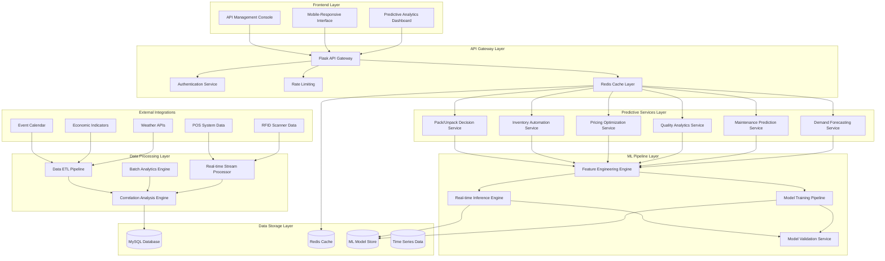
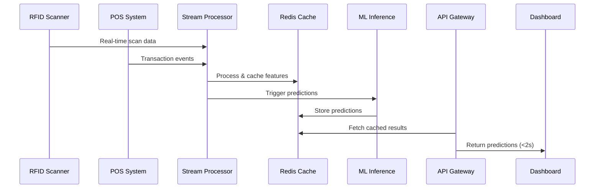
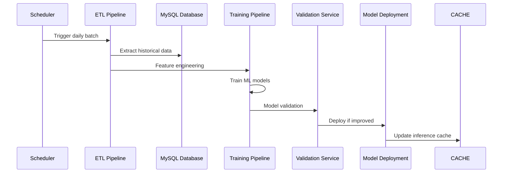

# RFID3 Predictive Analytics Architecture Design
**Version**: 1.0  
**Date**: August 31, 2025  
**Target Environment**: Raspberry Pi 5 with 8GB RAM  

## 🎯 Executive Summary

This document outlines a comprehensive, production-ready predictive analytics architecture for the RFID3 inventory management system. The architecture is designed to achieve Phase 3 business objectives of **$15k/month cost reduction** and **$25k/month revenue increase** through intelligent automation and predictive capabilities.

### Key Architecture Principles
- **Modular Design**: Separate, loosely-coupled services for scalability
- **Performance First**: Optimized for Pi 5 constraints with <2 second response times
- **Real-time & Batch Processing**: Hybrid architecture for immediate insights and deep analysis
- **Production Ready**: Comprehensive monitoring, error handling, and fallback systems
- **Incremental Growth**: Designed to scale from 50k to 500k+ records

---

## 🏗️ System Architecture Overview



---

## 📊 Service Decomposition & Architecture

### 1. **Demand Forecasting Service**
**Purpose**: Predict future demand patterns with seasonal adjustments

**Core Components**:
```python
# Architecture Pattern
DemandForecastService:
  - SeasonalTrendAnalyzer
  - EventImpactPredictor
  - WeatherCorrelationEngine
  - DemandModelManager
  - ForecastValidator
```

**Key Features**:
- Multi-model ensemble (ARIMA, Prophet, Linear Regression)
- Seasonal pattern recognition with holiday detection
- Weather correlation integration
- Real-time forecast updates
- Confidence interval calculation

**Data Dependencies**:
- Historical transaction data (2+ years)
- Weather API data
- Local event calendar
- Economic indicators
- POS transaction patterns

---

### 2. **Maintenance Prediction Service**
**Purpose**: Predict equipment failure and optimize maintenance schedules

**Core Components**:
```python
MaintenancePredictionService:
  - FailureProbabilityCalculator
  - MaintenanceScheduleOptimizer
  - ComponentLifecycleTracker
  - CostImpactAnalyzer
  - ResourcePlanningEngine
```

**Key Features**:
- Usage-based failure probability modeling
- Cost-optimized maintenance scheduling
- Component replacement timing
- Resource allocation planning
- ROI-driven maintenance decisions

**Data Dependencies**:
- Equipment usage history
- Maintenance records
- Quality degradation patterns
- Repair cost data
- Utilization metrics

---

### 3. **Quality Analytics Service**
**Purpose**: Analyze quality degradation and optimize lifecycle management

**Core Components**:
```python
QualityAnalyticsService:
  - QualityDegradationPredictor
  - LifecycleOptimizer
  - ReplacementTimingEngine
  - QualityPriceCorrelator
  - InspectionScheduler
```

**Key Features**:
- ML-based quality scoring
- Degradation pattern recognition
- Optimal replacement timing
- Quality-price relationship analysis
- Automated inspection scheduling

---

### 4. **Pricing Optimization Service**
**Purpose**: Dynamic pricing recommendations based on demand, quality, and market conditions

**Core Components**:
```python
PricingOptimizationService:
  - DemandElasticityCalculator
  - CompetitorPriceAnalyzer
  - SeasonalPricingEngine
  - QualityPriceAdjuster
  - RevenueOptimizer
```

**Key Features**:
- Dynamic pricing algorithms
- Competitor price monitoring
- Quality-adjusted pricing
- Revenue optimization models
- A/B testing framework

---

### 5. **Inventory Automation Service**
**Purpose**: Automated restock decisions and inventory optimization

**Core Components**:
```python
InventoryAutomationService:
  - RestockDecisionEngine
  - VelocityClassifier
  - ROICalculator
  - SupplierIntegration
  - AlertingSystem
```

**Key Features**:
- Automated restock triggers
- Velocity-based categorization
- ROI-optimized ordering
- Supplier integration
- Multi-level alerting

---

### 6. **Pack/Unpack Decision Service**
**Purpose**: Intelligent pack creation and dissolution recommendations

**Core Components**:
```python
PackDecisionService:
  - PackPerformanceAnalyzer
  - ComponentDemandCorrelator
  - ProfitabilityCalculator
  - PackLifecycleManager
  - RecommendationEngine
```

**Key Features**:
- Pack utilization analysis
- Component demand correlation
- Profitability optimization
- Lifecycle management
- Decision automation

---

## 🔄 Data Flow Architecture

### Real-time Data Pipeline


### Batch Processing Pipeline


---

## 🚀 Performance Optimization Strategies

### 1. **Pi 5 Hardware Optimization**
```python
# Memory Management Configuration
MEMORY_OPTIMIZATION = {
    "mysql_buffer_pool": "2GB",        # 25% of total RAM
    "redis_maxmemory": "1GB",          # Cache layer
    "python_processes": 4,             # CPU cores
    "ml_model_cache": "512MB",         # Model storage
    "feature_cache": "256MB"           # Feature vectors
}
```

### 2. **Caching Strategy**
```python
# Multi-layer Caching Architecture
CACHE_LAYERS = {
    "L1_MEMORY": "In-process Python cache (100ms TTL)",
    "L2_REDIS": "Redis cache (5min TTL)", 
    "L3_DATABASE": "MySQL with optimized indexes",
    "L4_MODEL_CACHE": "Pre-computed predictions (1hr TTL)"
}
```

### 3. **Database Optimization**
```sql
-- Optimized Indexes for Predictive Analytics
CREATE INDEX idx_analytics_predictions_composite 
ON analytics_predictions(prediction_type, target_item_id, prediction_date);

CREATE INDEX idx_item_master_analytics 
ON id_item_master(status, quality, date_last_scanned);

CREATE INDEX idx_transactions_time_series 
ON id_transactions(scan_date, tag_id, scan_type);
```

### 4. **Asynchronous Processing**
```python
# Background Task Architecture
ASYNC_TASKS = {
    "model_training": "Celery + Redis queue",
    "batch_predictions": "APScheduler background",
    "data_ingestion": "asyncio stream processing",
    "notification_system": "Event-driven messaging"
}
```

---

## 🔌 API Endpoint Specifications

### Core Prediction APIs
```python
# Demand Forecasting
GET  /api/predictive/demand/forecast?weeks=4&category=chairs&store=all
POST /api/predictive/demand/retrain
GET  /api/predictive/demand/accuracy

# Maintenance Predictions  
GET  /api/predictive/maintenance/schedule?days=30
GET  /api/predictive/maintenance/probability/{item_id}
POST /api/predictive/maintenance/feedback

# Quality Analytics
GET  /api/predictive/quality/degradation/{item_id}
GET  /api/predictive/quality/replacement-recommendations
POST /api/predictive/quality/inspection-result

# Pricing Optimization
GET  /api/predictive/pricing/recommendations?category=tables
GET  /api/predictive/pricing/elasticity-analysis
POST /api/predictive/pricing/test-price

# Inventory Automation
GET  /api/predictive/inventory/restock-alerts
GET  /api/predictive/inventory/optimization-recommendations
POST /api/predictive/inventory/approve-restock/{item_id}

# Pack Management
GET  /api/predictive/packs/performance-analysis
GET  /api/predictive/packs/recommendations
POST /api/predictive/packs/create-pack
DELETE /api/predictive/packs/dissolve-pack/{pack_id}
```

### Management & Monitoring APIs
```python
# Model Management
GET  /api/predictive/models/status
GET  /api/predictive/models/performance
POST /api/predictive/models/retrain/{service}
GET  /api/predictive/models/version-history

# System Health
GET  /api/predictive/health/system-status
GET  /api/predictive/health/performance-metrics
GET  /api/predictive/health/prediction-accuracy
```

---

## 💾 Database Schema Extensions

### Predictive Analytics Tables
```sql
-- Enhanced Analytics Predictions Table
CREATE TABLE analytics_predictions (
    id INT AUTO_INCREMENT PRIMARY KEY,
    prediction_type ENUM('demand', 'maintenance', 'quality', 'pricing', 'restock', 'pack') NOT NULL,
    target_item_id VARCHAR(255),
    target_category VARCHAR(100),
    prediction_date DATETIME NOT NULL,
    horizon_days INT DEFAULT 7,
    predicted_value DECIMAL(15,4),
    confidence_score DECIMAL(5,4),
    confidence_lower DECIMAL(15,4),
    confidence_upper DECIMAL(15,4),
    model_version VARCHAR(50),
    model_type VARCHAR(50),
    input_features JSON,
    external_factors JSON,
    business_impact_score DECIMAL(5,2),
    actual_value DECIMAL(15,4) NULL,
    accuracy_score DECIMAL(5,4) NULL,
    feedback_rating INT CHECK (feedback_rating BETWEEN 1 AND 5),
    created_at DATETIME DEFAULT CURRENT_TIMESTAMP,
    validated_at DATETIME NULL,
    
    INDEX idx_type_date_item (prediction_type, prediction_date, target_item_id),
    INDEX idx_confidence (confidence_score),
    INDEX idx_business_impact (business_impact_score),
    INDEX idx_accuracy_tracking (prediction_type, accuracy_score),
    
    FOREIGN KEY (target_item_id) REFERENCES id_item_master(tag_id) ON DELETE SET NULL
);

-- Model Performance Tracking
CREATE TABLE ml_model_performance (
    id INT AUTO_INCREMENT PRIMARY KEY,
    service_name VARCHAR(100) NOT NULL,
    model_type VARCHAR(50) NOT NULL,
    model_version VARCHAR(50) NOT NULL,
    training_date DATETIME NOT NULL,
    deployment_date DATETIME NULL,
    performance_metrics JSON,
    accuracy_score DECIMAL(5,4),
    precision_score DECIMAL(5,4),
    recall_score DECIMAL(5,4),
    f1_score DECIMAL(5,4),
    mae DECIMAL(10,4),
    rmse DECIMAL(10,4),
    training_data_size INT,
    validation_data_size INT,
    hyperparameters JSON,
    feature_importance JSON,
    is_active BOOLEAN DEFAULT FALSE,
    created_at DATETIME DEFAULT CURRENT_TIMESTAMP,
    
    INDEX idx_service_version (service_name, model_version),
    INDEX idx_accuracy (accuracy_score),
    INDEX idx_deployment (deployment_date, is_active)
);

-- Feature Store for ML Pipeline
CREATE TABLE ml_feature_store (
    id INT AUTO_INCREMENT PRIMARY KEY,
    feature_name VARCHAR(100) NOT NULL,
    feature_category VARCHAR(50),
    target_entity VARCHAR(255),
    feature_value DECIMAL(15,6),
    feature_timestamp DATETIME NOT NULL,
    data_source VARCHAR(100),
    computation_method VARCHAR(100),
    is_real_time BOOLEAN DEFAULT FALSE,
    quality_score DECIMAL(3,2) DEFAULT 1.00,
    created_at DATETIME DEFAULT CURRENT_TIMESTAMP,
    
    UNIQUE KEY unique_feature_entity_time (feature_name, target_entity, feature_timestamp),
    INDEX idx_feature_time (feature_name, feature_timestamp),
    INDEX idx_entity_time (target_entity, feature_timestamp),
    INDEX idx_real_time_features (is_real_time, feature_timestamp)
);

-- External Data Integration
CREATE TABLE external_data_factors (
    id INT AUTO_INCREMENT PRIMARY KEY,
    factor_type ENUM('weather', 'economic', 'seasonal', 'market', 'events') NOT NULL,
    factor_name VARCHAR(100) NOT NULL,
    factor_value DECIMAL(15,6),
    measurement_date DATETIME NOT NULL,
    data_source VARCHAR(100),
    api_endpoint VARCHAR(500),
    quality_confidence DECIMAL(3,2) DEFAULT 1.00,
    correlation_strength DECIMAL(4,3) NULL,
    business_relevance_score DECIMAL(3,2),
    created_at DATETIME DEFAULT CURRENT_TIMESTAMP,
    
    INDEX idx_type_date (factor_type, measurement_date),
    INDEX idx_correlation (correlation_strength),
    INDEX idx_business_relevance (business_relevance_score)
);

-- Automated Decision Tracking
CREATE TABLE automated_decisions (
    id INT AUTO_INCREMENT PRIMARY KEY,
    decision_type ENUM('restock', 'maintenance', 'pricing', 'pack_create', 'pack_dissolve') NOT NULL,
    target_entity VARCHAR(255),
    decision_confidence DECIMAL(5,4),
    predicted_impact DECIMAL(15,2),
    decision_data JSON,
    auto_approved BOOLEAN DEFAULT FALSE,
    human_override BOOLEAN DEFAULT FALSE,
    execution_status ENUM('pending', 'approved', 'rejected', 'executed', 'failed') DEFAULT 'pending',
    execution_date DATETIME NULL,
    actual_impact DECIMAL(15,2) NULL,
    feedback_score INT CHECK (feedback_score BETWEEN 1 AND 5),
    created_at DATETIME DEFAULT CURRENT_TIMESTAMP,
    updated_at DATETIME DEFAULT CURRENT_TIMESTAMP ON UPDATE CURRENT_TIMESTAMP,
    
    INDEX idx_type_status (decision_type, execution_status),
    INDEX idx_confidence (decision_confidence),
    INDEX idx_impact (predicted_impact)
);
```

---

## 🔧 Technology Stack & Dependencies

### Core ML Dependencies
```python
# requirements_ml.txt
scikit-learn==1.3.2          # Primary ML framework
numpy==1.24.3                # Numerical computing
pandas==2.0.3                # Data manipulation
statsmodels==0.14.0          # Statistical models
prophet==1.1.4               # Time series forecasting
scipy==1.11.4                # Scientific computing
joblib==1.3.2                # Model persistence
matplotlib==3.7.2            # Visualization
seaborn==0.12.2              # Statistical visualization

# Performance & Async
celery==5.3.4                # Background task queue
asyncio==3.4.3               # Async programming
uvloop==0.19.0               # Fast event loop
aioredis==2.0.1              # Async Redis client

# API & Web
flask-restx==1.3.0           # API documentation
marshmallow==3.20.1          # Data serialization
flask-limiter==3.6.0         # Rate limiting
flask-cors==4.0.0            # CORS handling

# Monitoring & Logging
prometheus-client==0.19.0    # Metrics collection
structlog==23.2.0            # Structured logging
sentry-sdk==1.38.0           # Error tracking
```

### Configuration Management
```python
# config/predictive_analytics.py
PREDICTIVE_CONFIG = {
    "models": {
        "demand_forecast": {
            "algorithms": ["prophet", "arima", "linear"],
            "ensemble_weights": [0.5, 0.3, 0.2],
            "retrain_frequency": "weekly",
            "min_accuracy_threshold": 0.75
        },
        "maintenance_prediction": {
            "algorithms": ["random_forest", "gradient_boosting"],
            "feature_importance_threshold": 0.05,
            "retrain_frequency": "daily",
            "min_precision_threshold": 0.80
        }
    },
    "performance": {
        "max_response_time": 2.0,  # seconds
        "cache_ttl": 300,          # 5 minutes
        "batch_size": 1000,
        "max_memory_usage": "2GB"
    },
    "data_requirements": {
        "min_historical_days": 365,
        "feature_staleness_hours": 24,
        "external_data_timeout": 30  # seconds
    }
}
```

---

## 📈 Business Impact & KPI Tracking

### Revenue Optimization Metrics
```python
REVENUE_KPIS = {
    "pricing_optimization": {
        "metric": "revenue_per_rental_increase",
        "target": "8% increase ($25k/month)",
        "measurement": "weekly_revenue_comparison"
    },
    "demand_forecasting": {
        "metric": "stockout_reduction",
        "target": "40% reduction",
        "measurement": "missed_rental_opportunities"
    },
    "inventory_optimization": {
        "metric": "inventory_turnover_improvement", 
        "target": "15% increase",
        "measurement": "turns_per_year"
    }
}

COST_REDUCTION_KPIS = {
    "automated_restocking": {
        "metric": "manual_process_time_reduction",
        "target": "60% time saving ($15k/month)",
        "measurement": "hours_per_week_saved"
    },
    "maintenance_optimization": {
        "metric": "emergency_repair_cost_reduction",
        "target": "25% cost reduction", 
        "measurement": "unplanned_maintenance_costs"
    },
    "quality_management": {
        "metric": "premature_replacement_reduction",
        "target": "20% reduction",
        "measurement": "replacement_frequency"
    }
}
```

### Operational Efficiency Metrics
```python
OPERATIONAL_KPIS = {
    "prediction_accuracy": {
        "demand_forecast": ">80% accuracy",
        "maintenance_prediction": ">75% accuracy", 
        "quality_degradation": ">70% accuracy"
    },
    "system_performance": {
        "api_response_time": "<2 seconds",
        "system_uptime": ">99.5%",
        "data_freshness": "<1 hour lag"
    },
    "user_adoption": {
        "recommendation_acceptance_rate": ">60%",
        "automated_decision_accuracy": ">85%",
        "user_satisfaction_score": ">4.0/5.0"
    }
}
```

---

## 🚢 Deployment & Scaling Strategy

### Phase 1: Foundation (Weeks 1-2)
```bash
# Infrastructure Setup
1. Deploy core ML services with basic models
2. Implement caching layer and API gateway
3. Set up monitoring and logging
4. Create basic prediction endpoints

# Success Criteria:
- API response times <2 seconds
- Basic demand forecasting operational
- Monitoring dashboard functional
```

### Phase 2: Core Services (Weeks 3-4)  
```bash
# Service Implementation
1. Deploy maintenance prediction service
2. Implement quality analytics service
3. Add pricing optimization features
4. Create automated decision framework

# Success Criteria:
- All 6 core services operational
- Model accuracy meets thresholds
- Automated decisions functioning
```

### Phase 3: Optimization & Integration (Weeks 5-6)
```bash
# Performance & Integration
1. Optimize model performance and accuracy
2. Integrate with existing business processes
3. Implement advanced caching strategies
4. Add comprehensive monitoring

# Success Criteria:
- Performance targets met
- Business process integration complete
- User training completed
```

### Horizontal Scaling Plan
```python
SCALING_ARCHITECTURE = {
    "50k_records": "Single Pi 5 instance",
    "100k_records": "Pi 5 + external Redis cache",
    "250k_records": "Pi 5 cluster (2 nodes) + load balancer",
    "500k_records": "Multi-node cluster + MySQL read replicas",
    "1M_records": "Cloud migration recommended"
}
```

---

## 🛡️ Risk Mitigation & Fallback Systems

### Technical Risk Mitigation
```python
FALLBACK_SYSTEMS = {
    "ml_model_failure": {
        "primary": "Ensemble model predictions",
        "secondary": "Historical average fallback",
        "tertiary": "Manual override system"
    },
    "data_source_failure": {
        "primary": "Cached historical data",
        "secondary": "External API retry logic", 
        "tertiary": "Sample data generation"
    },
    "performance_degradation": {
        "primary": "Automatic cache warming",
        "secondary": "Model complexity reduction",
        "tertiary": "Service graceful degradation"
    }
}
```

### Business Risk Mitigation
```python
BUSINESS_SAFEGUARDS = {
    "automated_decision_limits": {
        "max_restock_value": "$5000 per decision",
        "max_price_change": "20% from baseline",
        "require_approval_threshold": "$1000"
    },
    "prediction_confidence_gates": {
        "high_confidence": ">0.8 (auto-approve)",
        "medium_confidence": "0.6-0.8 (flag for review)",
        "low_confidence": "<0.6 (manual decision required)"
    }
}
```

---

## 📊 Monitoring & Alerting

### System Health Dashboard
```python
MONITORING_METRICS = {
    "system_health": [
        "api_response_times",
        "prediction_accuracy_scores", 
        "model_performance_drift",
        "data_pipeline_health",
        "cache_hit_rates"
    ],
    "business_metrics": [
        "revenue_impact_tracking",
        "cost_savings_measurement",
        "user_adoption_rates",
        "decision_accuracy_rates",
        "roi_calculations"
    ],
    "operational_alerts": [
        "model_accuracy_degradation",
        "data_source_failures",
        "system_performance_issues",
        "high_value_automated_decisions",
        "prediction_confidence_anomalies"
    ]
}
```

---

## 🎯 Success Criteria & Validation

### Phase 3 Objectives Validation
- **Cost Reduction Target**: $15,000/month through automation
  - Measurement: Weekly cost tracking vs. baseline
  - Validation: 3-month running average
  
- **Revenue Increase Target**: $25,000/month through optimization  
  - Measurement: Revenue per rental improvement
  - Validation: Quarterly revenue analysis

- **Operational Efficiency**: 40% stockout reduction, 15% turnover improvement
  - Measurement: Daily operational metrics
  - Validation: Monthly performance reviews

### Technical Performance Validation
- **Response Time**: <2 seconds for all prediction APIs
- **Accuracy**: >75% accuracy across all prediction services  
- **Uptime**: >99.5% system availability
- **Scalability**: Handle 2x data volume without performance degradation

---

## 🔄 Implementation Roadmap

### Immediate Next Steps (Week 1)
1. **Database Schema Implementation**
   - Deploy new analytics tables
   - Create optimized indexes
   - Set up data migration scripts

2. **Core Service Framework**
   - Implement base service classes
   - Set up API endpoint structure
   - Create caching architecture

3. **ML Pipeline Foundation**
   - Set up feature engineering pipeline
   - Implement model training framework
   - Create model persistence system

### Development Milestones
- **Week 2**: Demand forecasting service operational
- **Week 3**: Maintenance prediction service deployed  
- **Week 4**: Quality analytics and pricing optimization
- **Week 5**: Inventory automation and pack management
- **Week 6**: System optimization and business integration

This comprehensive architecture provides the foundation for achieving the Phase 3 business objectives while maintaining system reliability, performance, and scalability for future growth.