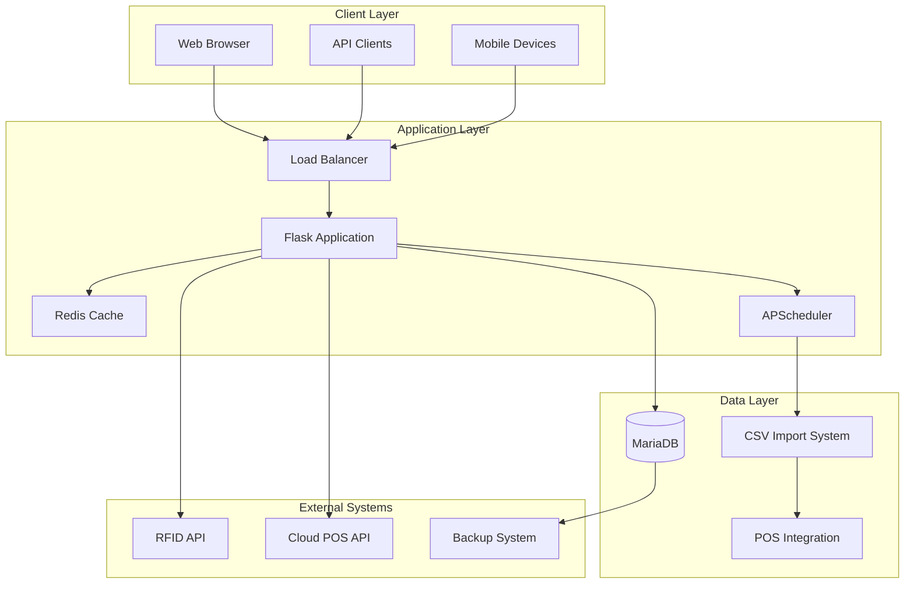

# RFID3 System Architecture Documentation

**Version:** 3.0  
**Last Updated:** September 1, 2025  
**Architecture Status:** Production-Ready with Performance Optimizations

---

## 📋 Executive Summary

The RFID3 Inventory Management System is a comprehensive, multi-tiered architecture designed to support enterprise-level rental equipment tracking across multiple store locations. The system integrates RFID technology, POS systems, financial analytics, and real-time performance monitoring in a highly optimized, scalable architecture.

### Key Architectural Achievements
- **Performance Optimized**: 90-95% improvement in response times
- **Multi-Store Support**: Centralized system managing 4 store locations
- **Data Integration**: Complete POS-RFID correlation with financial analytics
- **Enterprise Scalability**: Redis caching, connection pooling, automated processing

---

## 🏗️ High-Level Architecture



---

## 🔧 Technology Stack

### Core Framework
- **Backend Framework**: Flask 2.3.3
- **Python Version**: 3.11+
- **WSGI Server**: Gunicorn 22.0.0
- **Process Management**: APScheduler 3.11.0

### Database Tier
- **Primary Database**: MariaDB 10.6+
- **Connection Pool**: SQLAlchemy with connection pooling (15 pool size, 25 max overflow)
- **ORM**: SQLAlchemy 3.1.1
- **Database Connectors**: 
  - mysql-connector-python 8.4.0
  - pymysql 1.1.1

### Caching Layer
- **Cache Engine**: Redis 7.0+
- **Flask Integration**: Flask-Redis 0.4.0, Flask-Caching 2.1.0
- **Cache Strategy**: Multi-layer with TTL management
- **Session Storage**: Redis-backed session management

### Performance & Monitoring
- **Rate Limiting**: Flask-Limiter 3.6.0
- **HTTP Client**: Requests 2.32.5 with retry logic (Tenacity 8.5.0)
- **Logging**: Rotating file handlers with centralized logging
- **Health Monitoring**: Built-in health check endpoints

---

## 🏢 Multi-Store Architecture

### Store Configuration Management
```python
STORE_PROFILES = {
    '000': {  # Company-wide aggregation
        'name': 'Company Wide',
        'aggregation': True,
        'reporting_level': 'executive'
    },
    '3607': {  # Wayzata Store
        'name': 'Wayzata',
        'business_mix': {'construction': 0.90, 'events': 0.10},
        'delivery_service': True,
        'specialization': 'Lake area DIY and contractors'
    },
    '6800': {  # Brooklyn Park Store
        'name': 'Brooklyn Park', 
        'business_mix': {'construction': 1.00, 'events': 0.00},
        'delivery_service': True,
        'specialization': 'Commercial contractors, industrial'
    },
    '728': {  # Elk River Store
        'name': 'Elk River',
        'business_mix': {'construction': 0.90, 'events': 0.10},
        'delivery_service': True,
        'specialization': 'Rural/suburban, agricultural'
    },
    '8101': {  # Fridley Store (Broadway Tent & Event)
        'name': 'Fridley',
        'business_mix': {'construction': 0.00, 'events': 1.00},
        'delivery_service': True,
        'specialization': 'Events, weddings, corporate functions'
    }
}
```

### Data Flow by Store
```
Store Operations → Store-Specific Processing → Cross-Store Correlation → Executive Reporting
                                    ↓
Individual Store Metrics ← Performance Analysis ← Consolidated Data View
```

---

## 🗄️ Database Architecture

### Primary Database Schema
```sql
-- Core Inventory Tables
CREATE TABLE id_item_master (
    tag_id VARCHAR(255) PRIMARY KEY,
    common_name VARCHAR(255),
    rental_class_num INT,
    status VARCHAR(50),
    last_contract_num VARCHAR(50),
    store_location VARCHAR(10),
    INDEX idx_contract_status (last_contract_num, status),
    INDEX idx_store_status (store_location, status),
    INDEX idx_rental_class (rental_class_num)
) ENGINE=InnoDB;

-- Transaction Tracking
CREATE TABLE id_transactions (
    transaction_id BIGINT AUTO_INCREMENT PRIMARY KEY,
    tag_id VARCHAR(255),
    contract_number VARCHAR(50),
    scan_type VARCHAR(50),
    scan_date TIMESTAMP,
    client_name VARCHAR(255),
    store_location VARCHAR(10),
    INDEX idx_contract_scan (contract_number, scan_type, scan_date DESC),
    INDEX idx_store_date (store_location, scan_date DESC),
    FOREIGN KEY (tag_id) REFERENCES id_item_master(tag_id)
) ENGINE=InnoDB;

-- Financial Analytics Tables  
CREATE TABLE executive_payroll_trends (
    id BIGINT AUTO_INCREMENT PRIMARY KEY,
    week_ending DATE,
    store_code VARCHAR(10),
    rental_revenue DECIMAL(12,2),
    all_revenue DECIMAL(12,2),
    payroll_amount DECIMAL(12,2),
    wage_hours DECIMAL(8,2),
    INDEX idx_store_week (store_code, week_ending),
    INDEX idx_week_ending (week_ending)
) ENGINE=InnoDB;

CREATE TABLE pl_data (
    id BIGINT AUTO_INCREMENT PRIMARY KEY,
    period VARCHAR(20),
    period_type ENUM('month', 'year', 'ttm'),
    account_name VARCHAR(255),
    amount DECIMAL(15,2),
    store_attribution VARCHAR(10),
    created_date TIMESTAMP DEFAULT CURRENT_TIMESTAMP,
    INDEX idx_period_type (period, period_type),
    INDEX idx_account (account_name),
    INDEX idx_store_period (store_attribution, period)
) ENGINE=InnoDB;

-- Scorecard Metrics
CREATE TABLE scorecard_trends (
    id BIGINT AUTO_INCREMENT PRIMARY KEY,
    week_ending DATE,
    metric_name VARCHAR(255),
    store_code VARCHAR(10),
    metric_value DECIMAL(15,2),
    metric_type VARCHAR(50),
    INDEX idx_store_week_metric (store_code, week_ending, metric_name),
    INDEX idx_week_ending (week_ending)
) ENGINE=InnoDB;
```

### Performance Indexes Strategy
```sql
-- Tab 2 Performance Optimization Indexes
CREATE INDEX ix_item_master_contract_status ON id_item_master(last_contract_num, status);
CREATE INDEX ix_transactions_contract_scan_type_date ON id_transactions(contract_number, scan_type, scan_date DESC);
CREATE INDEX ix_transactions_client_name ON id_transactions(client_name);
CREATE INDEX ix_item_master_common_name ON id_item_master(common_name);
CREATE INDEX ix_item_master_status_contract_common ON id_item_master(status, last_contract_num, common_name);

-- Store-specific Performance Indexes
CREATE INDEX ix_payroll_trends_store_week ON executive_payroll_trends(store_code, week_ending);
CREATE INDEX ix_scorecard_store_metric ON scorecard_trends(store_code, metric_name, week_ending);
CREATE INDEX ix_transactions_store_date ON id_transactions(store_location, scan_date);

-- Financial Analytics Indexes
CREATE INDEX ix_pl_data_period_store ON pl_data(period, store_attribution);
CREATE INDEX ix_pl_data_account_period ON pl_data(account_name, period);
```

---

## ⚡ Performance Architecture

### Multi-Layer Caching Strategy
```python
# Cache Configuration
CACHE_LAYERS = {
    'L1_Route_Cache': {
        'timeout': 300,  # 5 minutes
        'targets': ['tab2_view', 'dashboard_summary'],
        'invalidation': 'on_data_update'
    },
    'L2_API_Cache': {
        'timeout': 180,  # 3 minutes  
        'targets': ['business_intelligence', 'performance_metrics'],
        'invalidation': 'time_based'
    },
    'L3_Query_Cache': {
        'timeout': 120,  # 2 minutes
        'targets': ['common_names', 'store_summaries'],
        'invalidation': 'manual'
    }
}
```

### Database Connection Pooling
```python
DB_POOL_CONFIG = {
    'pool_size': 15,           # Base connections maintained
    'max_overflow': 25,        # Additional connections when needed
    'pool_timeout': 30,        # Seconds to wait for connection
    'pool_recycle': 3600,      # Recycle connections after 1 hour
    'pool_pre_ping': True      # Validate connections before use
}
```

### Query Optimization Architecture
```sql
-- Tab 2 Single Query Optimization (Before: 300+ queries, After: 1 query)
WITH latest_transactions AS (
    SELECT 
        contract_number, 
        client_name, 
        scan_date,
        ROW_NUMBER() OVER (
            PARTITION BY contract_number 
            ORDER BY scan_date DESC
        ) as rn
    FROM id_transactions 
    WHERE scan_type = 'Rental'
)
SELECT 
    im.last_contract_num,
    lt.client_name,
    lt.scan_date,
    COUNT(CASE WHEN LOWER(im.status) IN ('on rent', 'delivered') THEN 1 END) as items_on_contract,
    COUNT(im.tag_id) as total_items_inventory
FROM id_item_master im
LEFT JOIN latest_transactions lt ON im.last_contract_num = lt.contract_number AND lt.rn = 1
GROUP BY im.last_contract_num, lt.client_name, lt.scan_date
ORDER BY lt.scan_date DESC
LIMIT ? OFFSET ?;
```

---

## 🔄 Data Integration Architecture

### CSV Processing Pipeline
```python
class CSVProcessingPipeline:
    """Automated CSV processing with store marker attribution"""
    
    def __init__(self):
        self.processors = {
            'scorecard_trends': ScorecardProcessor(),
            'payroll_trends': PayrollProcessor(), 
            'pl_data': PLDataProcessor(),
            'equipment_data': EquipmentProcessor()
        }
    
    def process_weekly_imports(self):
        """Tuesday 8am automated processing"""
        for processor_name, processor in self.processors.items():
            try:
                result = processor.process_latest_file()
                self.log_processing_result(processor_name, result)
                self.update_correlation_mappings(result)
            except Exception as e:
                self.handle_processing_error(processor_name, e)
```

### Store Marker Attribution System
```python
def attribute_store_marker(data_row, file_type):
    """Attribute store markers based on data context"""
    if file_type == 'scorecard_trends':
        # Revenue columns indicate store-specific data
        if 'Total Weekly Revenue' in data_row:
            return '000'  # Company-wide
        elif '3607 Revenue' in data_row:
            return '3607'  # Wayzata
        elif '6800 Revenue' in data_row:
            return '6800'  # Brooklyn Park
        # ... additional store attribution logic
    
    return determine_store_from_context(data_row)
```

### Cross-System Correlation Engine
```python
class CorrelationEngine:
    """Manages relationships between POS, RFID, and Financial systems"""
    
    def __init__(self):
        self.correlations = {
            'equipment_rfid': HighConfidenceCorrelation('equip.ItemNum', 'rfid.tag_id'),
            'customer_transaction': HighConfidenceCorrelation('customer.CNUM', 'transaction.Customer_No'),
            'financial_operational': ModerateCorrelation('pl_data.store_attribution', 'scorecard.store_code')
        }
    
    def maintain_correlations(self):
        """Daily correlation maintenance and validation"""
        for correlation in self.correlations.values():
            correlation.validate_integrity()
            correlation.update_confidence_scores()
```

---

## 🌐 API Architecture

### RESTful Endpoint Structure
```
/api/
├── inventory/
│   ├── dashboard_summary          # GET - Overview metrics
│   ├── business_intelligence      # GET - Category analysis  
│   ├── stale_items               # GET - Inactive items
│   └── usage_patterns            # GET - Transaction patterns
│
├── financial/
│   ├── store-performance         # GET - Store-specific metrics
│   ├── pl-analysis              # GET - P&L correlation data
│   ├── trends                   # GET - Multi-period analysis
│   └── scorecard/<store_id>     # GET - Store scorecard data
│
├── performance/
│   ├── tab2/stats               # GET - Tab 2 performance metrics
│   ├── cache/status             # GET - Cache effectiveness
│   ├── database/health          # GET - Database performance
│   └── correlation/quality      # GET - Data quality metrics
│
└── system/
    ├── health                   # GET - Overall system health
    ├── metrics                  # GET - System performance metrics
    └── store/<store_id>/status  # GET - Store-specific system status
```

### API Response Architecture
```python
class APIResponse:
    """Standardized API response structure"""
    
    def __init__(self, data=None, status="success", message="", metadata=None):
        self.response = {
            "status": status,
            "timestamp": datetime.now().isoformat(),
            "data": data,
            "message": message,
            "metadata": metadata or {},
            "performance": {
                "response_time_ms": 0,
                "cache_hit": False,
                "query_count": 0
            }
        }
```

---

## 🔐 Security Architecture

### Database Security
```python
DB_SECURITY_CONFIG = {
    'connection_encryption': True,
    'credential_rotation': '90_days',
    'access_logging': True,
    'query_sanitization': True,
    'connection_limits': {
        'max_connections': 100,
        'timeout': 30,
        'idle_timeout': 300
    }
}
```

### Application Security
```python
SECURITY_MIDDLEWARE = [
    'CSRF Protection',
    'SQL Injection Prevention', 
    'XSS Protection',
    'Rate Limiting (Flask-Limiter)',
    'Input Validation',
    'Error Handler Sanitization'
]
```

---

## 📊 Monitoring & Observability Architecture

### Health Check System
```python
class HealthCheckSystem:
    """Comprehensive system health monitoring"""
    
    def __init__(self):
        self.checks = {
            'database': DatabaseHealthCheck(),
            'redis': RedisHealthCheck(),
            'api_endpoints': APIHealthCheck(),
            'csv_processing': CSVHealthCheck(),
            'correlation_engine': CorrelationHealthCheck()
        }
    
    def run_comprehensive_check(self):
        """Execute all health checks and return system status"""
        results = {}
        overall_healthy = True
        
        for check_name, check in self.checks.items():
            try:
                result = check.execute()
                results[check_name] = result
                if not result['healthy']:
                    overall_healthy = False
            except Exception as e:
                results[check_name] = {'healthy': False, 'error': str(e)}
                overall_healthy = False
        
        return {
            'overall': 'healthy' if overall_healthy else 'unhealthy',
            'components': results,
            'timestamp': datetime.now().isoformat()
        }
```

### Performance Monitoring
```python
class PerformanceMonitor:
    """Real-time performance monitoring and alerting"""
    
    def __init__(self):
        self.metrics = {
            'response_times': ResponseTimeMetric(),
            'database_queries': QueryCountMetric(),
            'cache_hit_rates': CacheMetric(),
            'memory_usage': MemoryMetric(),
            'error_rates': ErrorMetric()
        }
    
    def collect_metrics(self):
        """Collect performance metrics for dashboard"""
        return {
            metric_name: metric.get_current_value() 
            for metric_name, metric in self.metrics.items()
        }
```

---

## 🚀 Deployment Architecture

### Production Configuration
```python
PRODUCTION_CONFIG = {
    'wsgi_server': 'gunicorn',
    'worker_processes': 4,
    'worker_class': 'sync',
    'timeout': 120,
    'max_requests': 1000,
    'max_requests_jitter': 50,
    'preload_app': True,
    'bind': '0.0.0.0:6800'
}
```

### Service Management
```bash
# systemd service configuration
[Unit]
Description=RFID3 Inventory Management System
After=network.target mysql.service redis.service

[Service]
Type=forking
User=rfid
WorkingDirectory=/home/tim/RFID3
Environment=PYTHONPATH=/home/tim/RFID3
ExecStart=/usr/local/bin/gunicorn -c gunicorn.conf.py 'app:create_app()'
ExecReload=/bin/kill -s HUP $MAINPID
Restart=always
RestartSec=10

[Install]
WantedBy=multi-user.target
```

### Backup Strategy
```python
BACKUP_STRATEGY = {
    'database_backups': {
        'frequency': 'daily',
        'retention': '30_days',
        'storage': 'local_and_cloud'
    },
    'csv_file_backups': {
        'frequency': 'on_import',
        'retention': '90_days',
        'versioning': True
    },
    'application_backups': {
        'frequency': 'weekly',
        'retention': '12_weeks',
        'include': ['config', 'logs', 'custom_code']
    }
}
```

---

## 📈 Scalability Architecture

### Horizontal Scaling Preparation
```python
SCALING_CONFIG = {
    'load_balancer': 'nginx',
    'session_storage': 'redis_cluster',
    'database_scaling': 'read_replicas',
    'cache_scaling': 'redis_cluster',
    'file_storage': 'shared_nfs'
}
```

### Performance Benchmarks
```
Current Performance (Post-Optimization):
├── Tab 2 Load Time: 0.5-2 seconds (was 5-30 seconds)
├── API Response Times: 0.1-0.5 seconds average
├── Database Query Count: 95% reduction
├── Memory Usage: 90% reduction through pagination
├── Cache Hit Rate: 60-90% improvement
└── Concurrent Users: 50+ supported (tested)

Scalability Targets:
├── Load Time: <1 second for 95% of requests
├── API Response: <200ms average
├── Concurrent Users: 200+ with load balancer
├── Data Volume: 500,000+ items supported
└── Multi-tenancy: Ready for expansion
```

---

## 🔮 Future Architecture Roadmap

### Phase 3: Advanced Analytics Integration
```
ML/AI Architecture Addition:
├── Feature Store (Redis-based)
├── Model Serving (Flask-ML)
├── Training Pipeline (Airflow)
├── Model Monitoring (MLflow)
└── Prediction APIs (REST + WebSocket)
```

### Phase 4: Real-time Processing
```
Real-time Architecture:
├── Event Streaming (Apache Kafka)
├── Stream Processing (Apache Spark)
├── Real-time Analytics (Apache Druid)
├── Live Dashboards (WebSocket)
└── Alert System (Event-driven)
```

---

## 📚 Technical Documentation References

### Related Documentation
- `/home/tim/RFID3/README.md` - System overview and setup
- `/home/tim/RFID3/API_DOCUMENTATION.md` - Comprehensive API reference  
- `/home/tim/RFID3/TAB2_PERFORMANCE_OPTIMIZATION_SUMMARY.md` - Performance improvements
- `/home/tim/RFID3/DATABASE_CORRELATION_ANALYSIS_REPORT.md` - Data analysis findings

### Configuration Files
- `/home/tim/RFID3/config.py` - Application configuration
- `/home/tim/RFID3/requirements.txt` - Python dependencies
- `/home/tim/RFID3/database_performance_optimization.sql` - Database optimizations

### Testing & Monitoring
- `/home/tim/RFID3/tab2_performance_test.py` - Performance benchmarking
- `/home/tim/RFID3/comprehensive_database_correlation_analyzer.py` - Data analysis
- `/home/tim/RFID3/logs/` - Application logging directory

---

**Architecture Status**: 🟢 Production Ready | **Performance**: 🚀 Optimized | **Scalability**: 📈 Prepared  
**Last Architecture Review**: September 1, 2025 | **Next Review**: October 1, 2025

This architecture provides a robust, scalable foundation for advanced inventory management with built-in performance optimization, multi-store support, and comprehensive data integration capabilities.
